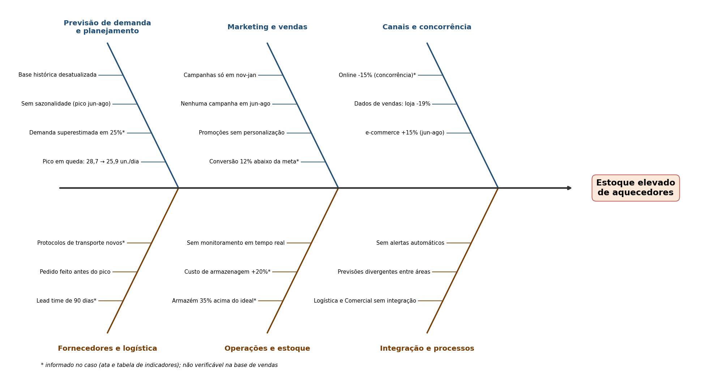

# Aula 3.1 · Análise das causas do estoque elevado de aquecedores

**Problema:** acúmulo de estoque de aquecedores elétricos na Zoop Megastore, com custos altos de armazenagem e falta de espaço.
**Escopo (como pede o prompt):** só mapear as causas. **Não há ações corretivas aqui**, elas ficam para a Aula 3.2.
**Fontes:** estudo de caso do Notion (ata de 12/08, tabela de indicadores) e a base `Zoop - Dados Vendas.xlsx` (jan/2022 a ago/2024), usada para verificar o que dá para verificar. A base de vendas **não tem estoque, pedidos, lead time, conversão nem custos**, então esses pontos vêm só do caso.

## 1. O que a base de vendas confirma (e o que contradiz)

| Verificação | Resultado nos dados |
|---|---|
| **Sazonalidade** | A demanda de jun a ago é de 2,44 a 2,69 vezes a dos meses de baixa (média diária). Em 2024: 25,85 un./dia em jun-ago contra 10,47 em mar-mai. |
| **Demanda em queda** | Vendas de jun a ago: 2.643 (2022), 2.458 (2023) e 2.378 (2024). Queda de 3,25% sobre 2023 e de 10,02% sobre 2022. Média diária do pico: 28,73 → 26,72 → 25,85. |
| **Campanhas fora da estação** | Todas as campanhas da base (Ano Novo, Black Friday e Natal) caem em janeiro, novembro e dezembro. **Nenhuma campanha em jun, jul ou ago**, o pico do aquecedor. |
| **Canal online** | O caso diz que o online caiu 15%. Na base, jun-ago de 2024 contra 2023 mostra o oposto para o aquecedor: **e-commerce +15,4%** (1.139 → 1.314) e **loja −19,3%** (1.319 → 1.064). A participação do e-commerce subiu de 46,3% para 55,3%. |
| **Preço** | Preço médio do aquecedor de R$ 2.501 (2022) para R$ 2.552 (2023) e R$ 2.596 (2024): cerca de +2% ao ano. Alta pequena, sem sinal de efeito grande sobre a demanda. |
| **Fim da temporada** | O caso afirma que a ata (12/08) está "fora da temporada de maior demanda". Mas jun-ago é o pico (a própria tabela diz isso) e, na base, agosto/2024 ainda vendeu 25,55 un./dia. A queda só vem em setembro. |

Observação: a data da ata está digitada como "12/08/2204", provavelmente erro de digitação para 2024.

## 2. Causas organizadas pelo framework MECE

### Causas internas (sob controle da empresa)

| ID | Causa | Evidência | Status |
|---|---|---|---|
| I1 | **Pedidos baseados em histórico desatualizado e sem sazonalidade** | Ata (Logística). A base mostra pico de jun-ago 2,4 a 2,7 vezes o vale e queda de 3,25% a 10,02% no pico. Se o planejamento usou o pico de 2022 (28,73 un./dia), superestimaria o de 2024 (25,85) em cerca de 11,1%. | Informada no caso; consistente com os dados |
| I2 | **Previsão de demanda superestimada em 25%** | Tabela de indicadores e ata (Comercial). A base só sustenta uma superestimativa de cerca de 11% a partir do pico de 2022, então **os 25% não são verificáveis**. | Informada no caso |
| I3 | **Campanhas de marketing fora do período de inverno** | Ata (Marketing). Confirmado: a base não tem nenhuma campanha em jun-ago. | **Confirmada nos dados** |
| I4 | **Promoções generalizadas, sem personalização** | Ata (Marketing). Conversão 12% abaixo da meta (tabela). A base não registra conversão. | Informada no caso |
| I5 | **Falta de integração entre Logística e Comercial** | Ata (Melhoria de Processos): previsões de demanda divergentes entre as áreas. | Informada no caso |
| I6 | **Falta de monitoramento em tempo real** | Ata (Melhoria de Processos): sem ajustes rápidos nas previsões e promoções. | Informada no caso |
| I7 | **Capacidade de armazenagem limitada** | Ata (Logística): o estoque ocupou 35% mais espaço que o previsto. Efeito do acúmulo, que amplia o problema (custo +20% em 3 meses). | Informada no caso |

### Causas externas (fora do controle direto)

| ID | Causa | Evidência | Status |
|---|---|---|---|
| E1 | **Lead time de fornecimento de 90 dias** | Tabela de indicadores e ata (Logística): novos protocolos de transporte elevaram o prazo. Com 90 dias, o pedido do pico (junho) precisa sair por volta de março, quando a venda diária é de cerca de 10 unidades, contra 25 a 29 no pico. *Inferência a partir do calendário.* | Informada no caso + inferência |
| E2 | **Sazonalidade forte e previsível** | Confirmada nos dados (2,44 a 2,69 vezes o vale). É estrutural, não anomalia, mas só vira excesso de estoque se o planejamento ignorá-la (ligada à I1). | **Confirmada nos dados** |
| E3 | **Concorrência agressiva no canal online (−15%)** | Ata (Comercial). **A base de vendas contradiz**: e-commerce +15,4% e loja −19,3% em jun-ago de 2024. A conversão de campanhas pode ter caído, mas o canal online do aquecedor não encolheu. | **Contradiz os dados** |
| E4 | **Preço e economia** | Preço médio +2% ao ano. Não há evidência no caso nem na base de choque de câmbio ou de matéria-prima. | Sem evidência de impacto relevante |

## 3. Diagrama de Ishikawa (causa e efeito)

O diagrama acima agrupa as causas em seis categorias:

| Categoria | Subcausas |
|---|---|
| Previsão de demanda e planejamento | Base histórica desatualizada; sazonalidade ignorada; demanda superestimada em 25%; pico em queda (28,7 → 25,9 un./dia) |
| Marketing e vendas | Campanhas só entre nov e jan; nenhuma campanha em jun-ago; promoções sem personalização; conversão 12% abaixo da meta |
| Canais e concorrência | Online −15% no caso; loja −19,3% e e-commerce +15,4% nos dados |
| Fornecedores e logística | Lead time de 90 dias; pedido feito antes do pico; novos protocolos de transporte |
| Operações e estoque | Armazém 35% acima do ideal; custo de armazenagem +20%; sem monitoramento em tempo real |
| Integração e processos | Logística e Comercial sem integração; previsões divergentes; sem alertas automáticos |

## 4. Análise quantitativa e qualitativa

**Quantitativa (dados verificados):**
- O pico de jun-ago caiu 10,02% em dois anos (de 2.643 para 2.378 unidades). Planejar pelo passado gera excesso.
- A razão pico/vale é estável, entre 2,44 e 2,69, então o padrão sazonal é conhecido.
- O aquecedor representa de 8,0% a 8,7% das unidades da Zoop por ano, então a falta de espaço é um problema de gestão do produto, não de volume total.
- Padrão fora do esperado: o canal online do aquecedor **cresce** enquanto a loja cai. O caso descreve o contrário.

**Qualitativa (informada pelas áreas):** promoções que não chegaram ao público certo, falta de comunicação entre Logística e Comercial, ausência de análise em tempo real, concorrência no online.

## 5. Conclusão: causas mais prováveis (por força de evidência)

1. **Planejamento sem sazonalidade e com base desatualizada (I1, I2, E2).** É a causa com mais respaldo: a sazonalidade é clara e o pico está em queda.
2. **Campanhas fora de época (I3).** Confirmada: nenhuma campanha ocorre no inverno.
3. **Lead time de 90 dias combinado com demanda sazonal (E1).** Aumenta o risco de pedir mais do que a venda real.
4. **Falta de integração e de monitoramento entre as áreas (I5, I6).** Explica por que os erros de previsão não foram corrigidos a tempo.
5. **Concorrência no online (E3).** Sem sustentação nos dados de vendas do aquecedor, então é a causa de menor confiança.

Ainda não foi possível verificar, por falta de dados: o tamanho real do estoque, os pedidos feitos, o lead time efetivo, a conversão das campanhas e os custos de armazenagem.

> **Próximo passo (Aula 3.2):** propor e priorizar ações corretivas (Matriz GUT e Esforço × Impacto) para essas causas.
