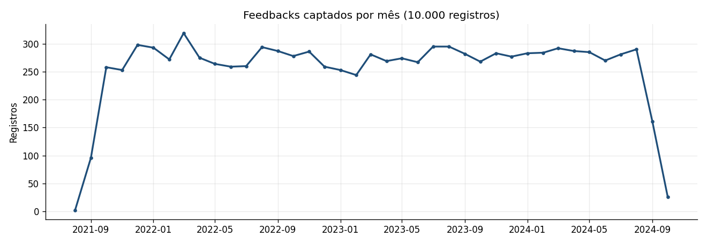
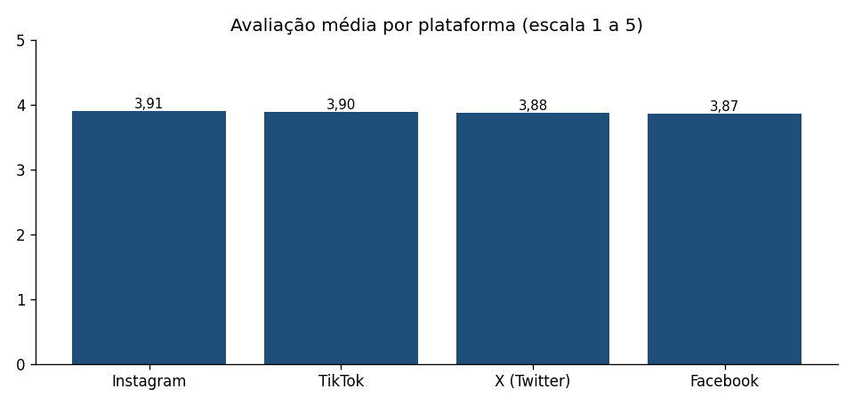
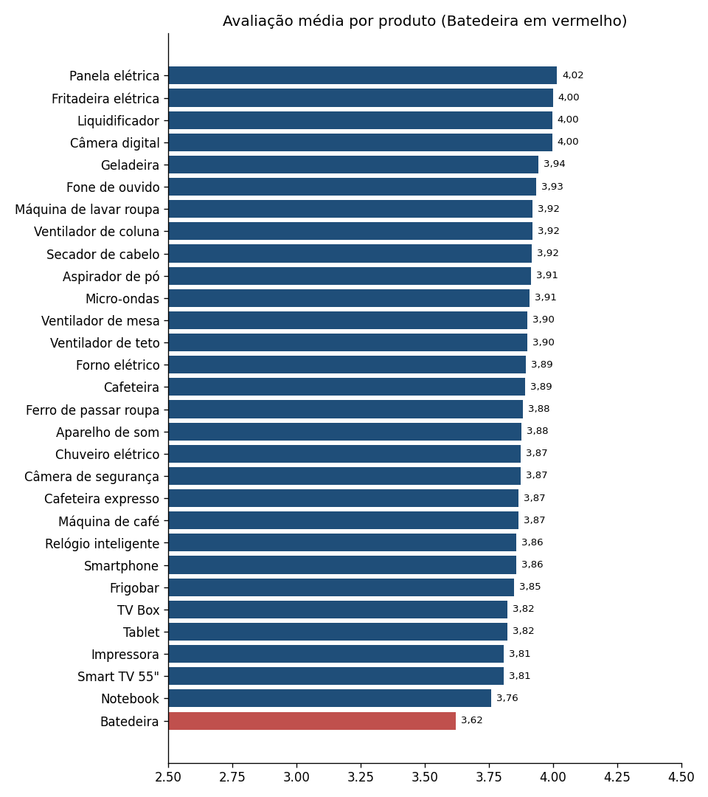
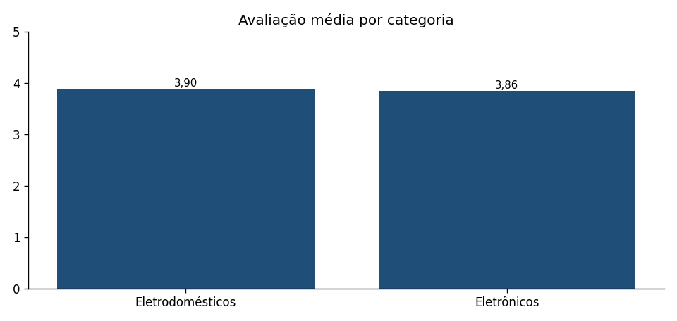
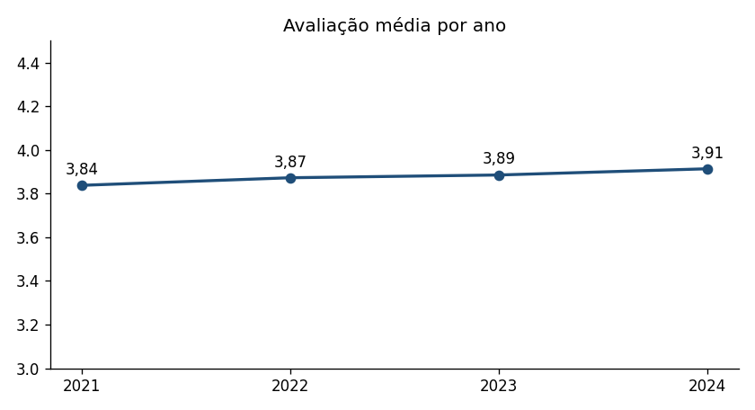
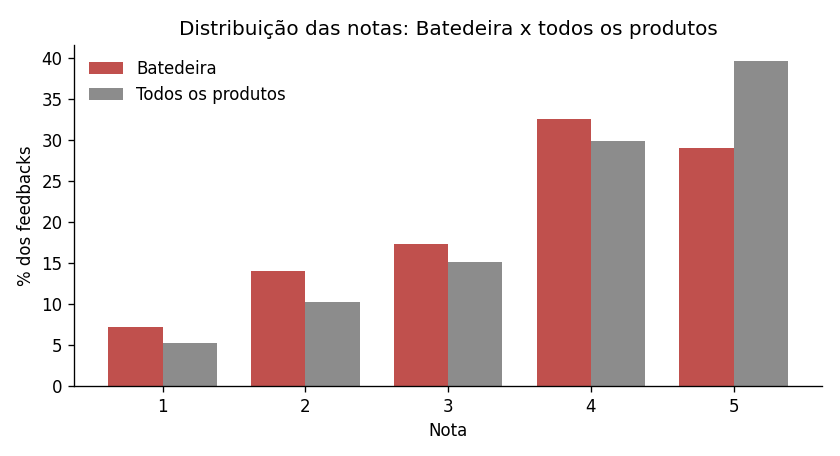
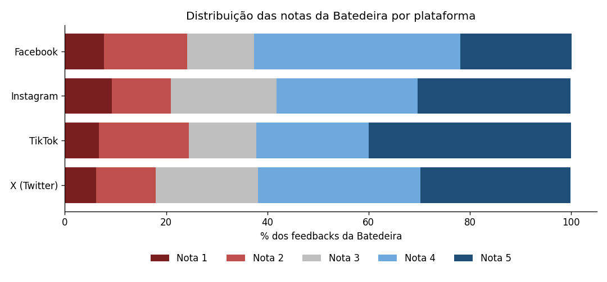
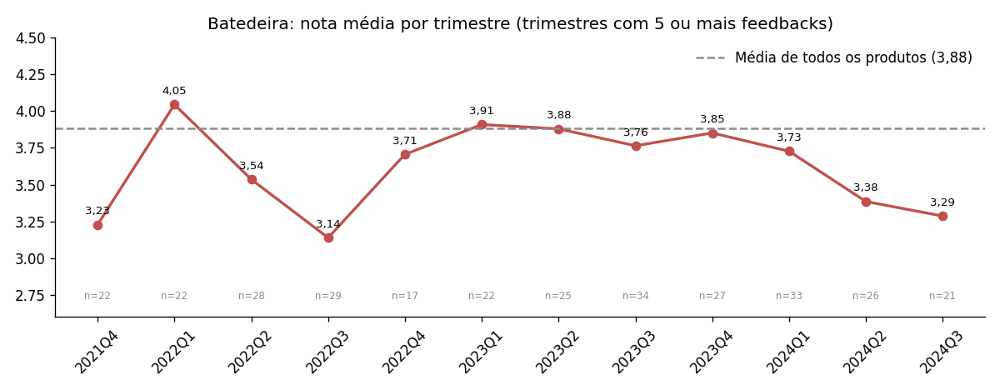

# Aula 4.1 · Análise dos feedbacks de clientes

**Base:** `Feedbacks nas redes_sociais_zoop.xlsx`, com 10.000 feedbacks de 30 produtos, avaliados de 1 a 5. Esta aula tem dois prompts em sequência: o **Prompt 1** dá a visão geral de toda a base, e o **Prompt 2** aprofunda uma variável. Escolhi aprofundar a **Batedeira por plataforma e por trimestre**, como sugeri no [planejamento](planejamento_aula_4.md).

---

## Prompt 1 · Visão geral dos feedbacks

### 1. Quantidade de registros

**10.000 registros**, sem valores nulos nem duplicados, de **30/08/2021 a 15/10/2024**.

### 2. Registros por ano e mês

| Ano | Registros | Observação |
|---|---:|---|
| 2021 | 907 | Captação começa em 30/08 (2 registros em agosto) |
| 2022 | 3.346 | Ano completo |
| 2023 | 3.288 | Ano completo |
| 2024 | 2.459 | Até 15/10 (161 registros em setembro e 26 em outubro, o que é parcial) |

Nos meses completos a captação fica estável, entre cerca de 245 e 320 feedbacks por mês (máximo de 319 em março/2022). Os meses de ago/2021, set/2021 (96) e out/2024 são parciais e puxam a linha para baixo nas pontas.

### 3. Avaliação média por plataforma

| Plataforma | Registros | Nota média |
|---|---:|---:|
| Instagram | 1.522 | 3,91 |
| TikTok | 1.458 | 3,90 |
| X (Twitter) | 3.975 | 3,88 |
| Facebook | 3.045 | 3,87 |

As médias são praticamente iguais (diferença de 0,04 ponto). O teste de Kruskal-Wallis dá **p = 0,69**, então não há diferença real entre plataformas na base toda. O X (Twitter) concentra 39,75% dos registros.

### 4. Avaliação média por produto

A nota média varia de **3,62 (Batedeira) a 4,02 (Panela elétrica)**. A **Batedeira é o último dos 30 produtos**, e o Notebook é o penúltimo (3,76).

Tabela completa dos 30 produtos

| Produto | Registros | Nota média |
|---|---:|---:|
| Panela elétrica | 305 | 4,02 |
| Fritadeira elétrica | 328 | 4,00 |
| Liquidificador | 349 | 4,00 |
| Câmera digital | 300 | 4,00 |
| Geladeira | 324 | 3,94 |
| Fone de ouvido | 333 | 3,93 |
| Máquina de lavar roupa | 329 | 3,92 |
| Ventilador de coluna | 323 | 3,92 |
| Secador de cabelo | 351 | 3,92 |
| Aspirador de pó | 337 | 3,91 |
| Micro-ondas | 330 | 3,91 |
| Ventilador de mesa | 345 | 3,90 |
| Ventilador de teto | 332 | 3,90 |
| Forno elétrico | 346 | 3,89 |
| Cafeteira | 358 | 3,89 |
| Ferro de passar roupa | 313 | 3,88 |
| Aparelho de som | 351 | 3,88 |
| Chuveiro elétrico | 358 | 3,87 |
| Câmera de segurança | 317 | 3,87 |
| Cafeteira expresso | 353 | 3,87 |
| Máquina de café | 350 | 3,87 |
| Relógio inteligente | 346 | 3,86 |
| Smartphone | 366 | 3,86 |
| Frigobar | 338 | 3,85 |
| TV Box | 339 | 3,82 |
| Tablet | 315 | 3,82 |
| Impressora | 323 | 3,81 |
| Smart TV 55" | 332 | 3,81 |
| Notebook | 302 | 3,76 |
| **Batedeira** | **307** | **3,62** |

### 5. Avaliação média por categoria

| Categoria | Registros | Nota média |
|---|---:|---:|
| Eletrodomésticos | 6.376 | 3,90 |
| Eletrônicos | 3.624 | 3,86 |

A diferença (0,04) não é significativa (teste de Mann-Whitney, p = 0,18).

### 6. Avaliação média por ano

| Ano | Registros | Nota média |
|---|---:|---:|
| 2021 | 907 | 3,84 |
| 2022 | 3.346 | 3,87 |
| 2023 | 3.288 | 3,89 |
| 2024 | 2.459 | 3,91 |

A nota geral sobe de forma suave a cada ano, mas a diferença não é significativa (p = 0,33).

### 7. Avaliação global

**Média geral: 3,88** (mediana 4, desvio padrão 1,19).

### Leitura do Prompt 1

A base é equilibrada: as notas são parecidas entre plataformas, categorias e anos. **O destaque negativo é um produto, a Batedeira**, que fica 0,26 ponto abaixo da média global e 0,14 abaixo do penúltimo colocado. Por isso o Prompt 2 aprofunda a Batedeira.

---

## Prompt 2 · Análise da variável escolhida: Batedeira por plataforma e por trimestre

### 1. Visão geral da Batedeira

| Medida | Batedeira | Todos os produtos |
|---|---:|---:|
| Feedbacks | 307 | 10.000 |
| Média | 3,62 | 3,88 |
| Mediana | 4 | 4 |
| Desvio padrão | 1,24 | 1,19 |
| Notas 1 e 2 | 21,17% | 15,40% |
| Nota 3 | 17,26% | 15,20% |
| Notas 4 e 5 | 61,56% | 69,40% |

### 2. Distribuição das notas (1 a 5)

| Nota | Batedeira | Todos os produtos |
|---:|---:|---:|
| 1 | 7,2% | 5,2% |
| 2 | 14,0% | 10,2% |
| 3 | 17,3% | 15,2% |
| 4 | 32,6% | 29,8% |
| 5 | 29,0% | 39,6% |

A principal diferença é que a Batedeira tem **10,6 pontos percentuais a menos de notas 5** e 5,8 pontos a mais de notas 1 e 2. A mediana é igual (4), então o problema não é uma rejeição geral, mas menos clientes entusiasmados e mais clientes insatisfeitos.

### 3. Por plataforma

| Plataforma | Feedbacks | Média | Mediana | Desvio padrão | Notas 1 e 2 | Notas 4 e 5 |
|---|---:|---:|---:|---:|---:|---:|
| Facebook | 91 | 3,53 | 4 | 1,22 | 24,18% | 62,64% |
| Instagram | 43 | 3,58 | 4 | 1,30 | 20,93% | 58,14% |
| X (Twitter) | 128 | 3,67 | 4 | 1,20 | 17,97% | 61,72% |
| TikTok | 45 | 3,71 | 4 | 1,34 | 24,44% | 62,22% |

Contagem de notas por plataforma:

| Plataforma | Nota 1 | Nota 2 | Nota 3 | Nota 4 | Nota 5 |
|---|---:|---:|---:|---:|---:|
| Facebook | 7 | 15 | 12 | 37 | 20 |
| Instagram | 4 | 5 | 9 | 12 | 13 |
| TikTok | 3 | 8 | 6 | 10 | 18 |
| X (Twitter) | 8 | 15 | 26 | 41 | 38 |

**Padrão:** o Facebook tem a menor média (3,53) e o TikTok a maior (3,71), mas a diferença **não é estatisticamente significativa** (Kruskal-Wallis p = 0,71; qui-quadrado p = 0,72). As amostras por plataforma são pequenas (43 a 128 feedbacks). A insatisfação com a Batedeira aparece em todas as plataformas, e não é um problema localizado.

### 4. Por trimestre

| Trimestre | Feedbacks | Nota média | Notas 1 e 2 |
|---|---:|---:|---:|
| 2021T4 | 22 | 3,23 | 36,36% |
| 2022T1 | 22 | 4,05 | 4,55% |
| 2022T2 | 28 | 3,54 | 17,86% |
| 2022T3 | 29 | 3,14 | 27,59% |
| 2022T4 | 17 | 3,71 | 11,76% |
| 2023T1 | 22 | 3,91 | 13,64% |
| 2023T2 | 25 | 3,88 | 12,00% |
| 2023T3 | 34 | 3,76 | 23,53% |
| 2023T4 | 27 | 3,85 | 14,81% |
| 2024T1 | 33 | 3,73 | 21,21% |
| 2024T2 | 26 | 3,38 | 30,77% |
| 2024T3 | 21 | 3,29 | 38,10% |

(O 3º trimestre de 2021 tem só 1 feedback e foi omitido do gráfico.)

**Queda recente.** De abril a setembro de 2024 a nota média foi de **3,34** (47 feedbacks), contra **3,82** de jan/2023 a mar/2024 (141 feedbacks). A parcela de notas 1 e 2 dobrou, de 17,73% para **34,04%**. O teste de Mann-Whitney dá **p = 0,054**: a queda está no limite da significância estatística e é coerente com o relato do diretor, mas não é conclusiva sozinha.

**Anomalias.** A nota da Batedeira oscila bastante e já teve dois vales que se recuperaram (2021T4, com 3,23, e 2022T3, com 3,14). Por isso não há tendência linear ao longo de 2022 a 2024 (correlação de Spearman −0,03; p = 0,60). A queda de 2024 é o terceiro vale; ainda não dá para saber se vai se recuperar como os anteriores.

### 5. Plataformas no período recente (abril a setembro de 2024)

| Plataforma | Feedbacks | Nota média |
|---|---:|---:|
| Facebook | 16 | 2,94 |
| X (Twitter) | 15 | 3,13 |
| Instagram | 6 | 3,67 |
| TikTok | 10 | 4,10 |

As amostras são muito pequenas (6 a 16 feedbacks). Facebook e X concentram as notas mais baixas, mas isso é só um indício a acompanhar.

### 6. Seguidores do autor

A correlação entre o número de seguidores do autor e a nota é praticamente nula (−0,003 na base toda; −0,01 na Batedeira). Os autores mais influentes não avaliam melhor nem pior.

### Conclusões do Prompt 2

1. **A Batedeira é o produto pior avaliado** (3,62; 30º de 30), com 21,17% de notas 1 e 2, contra 15,40% na base toda.
2. **O problema é geral entre plataformas**, sem diferença estatística entre elas.
3. **Há piora recente** (3,34 de abr a set/2024), compatível com o relato do diretor, mas no limite da significância (p = 0,054) e com histórico de oscilações.
4. **Por que o cliente avalia mal:** a nota não explica a causa. Isso será respondido na Aula 4.2, classificando o sentimento e os temas dos comentários (durabilidade e ruído, segundo o caso).

## Limites

- As amostras por plataforma e por trimestre são pequenas (de 17 a 34 feedbacks por trimestre), o que deixa os testes com pouca força.
- Os meses de agosto/2021, setembro/2021 e outubro/2024 são parciais.
- A nota mede satisfação, mas não explica o motivo: isso vem do texto dos comentários.

> **Próximo passo (Aula 4.2):** classificar os comentários da Batedeira em positivo, neutro e negativo, identificar os temas e gerar o mapa de calor por plataforma.
