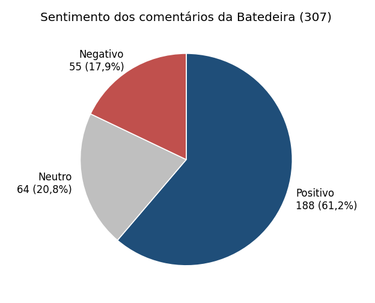
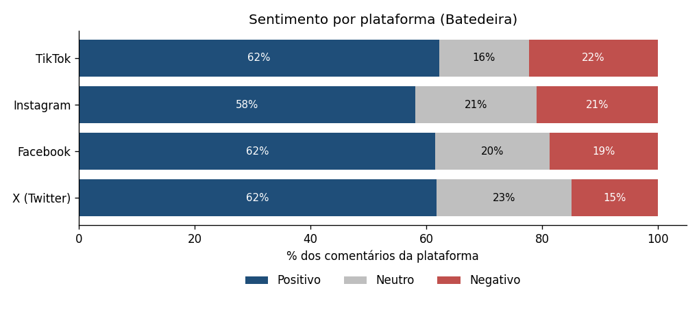
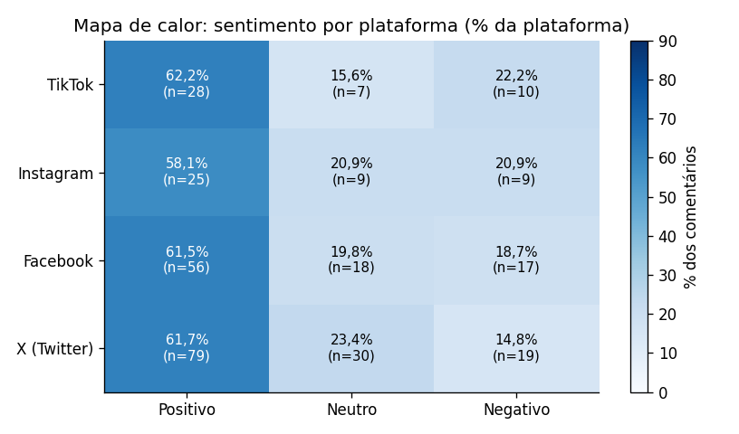
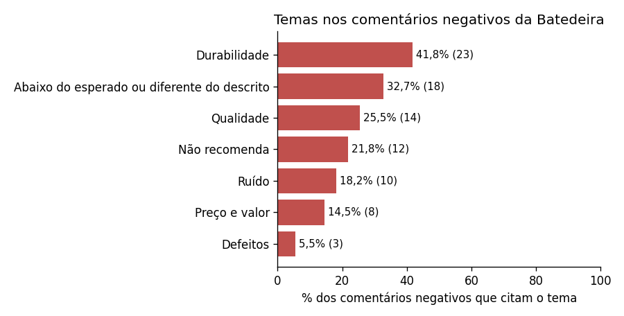
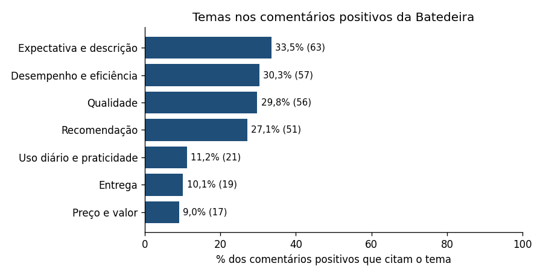

# Aula 4.2 · Identificando sentimentos nos feedbacks da Batedeira

**Produto analisado:** Batedeira (307 comentários, de 19/09/2021 a 21/09/2024), escolhido como pede o prompt da aula e como já indicado na [Aula 4.1](analise_feedbacks.md).
**Resultado por comentário:** [batedeira_sentimentos.csv](batedeira_sentimentos.csv) (sentimento e temas de cada um dos 307 comentários).

## 1. Como os sentimentos foram classificados

Usei a **tabela de palavras-chave do Notion** (positivo: ótimo, excelente, bom, perfeito, recomendo, satisfeito...; neutro: adequado, mediano, regular, razoável, cumpre, ok...; negativo: ruim, péssimo, quebrou, não recomendo, decepcionado, ruído...). Como os comentários usam outras palavras além dessas, acrescentei termos encontrados no texto (por exemplo "superou", "impressionado", "durabilidade baixa", "abaixo do esperado", "diferente do descrito"), todos registrados nas regras.

**Regras do Notion para variações de frases:**
- **Negações invertem o sentido:** "não recomendo", "não fiquei satisfeito", "nada bom", "não valeu a pena" contam como negativos, mesmo com palavras positivas dentro. "Não é ruim" é tratado como neutro.
- **Frases com dois sentidos:** quando aparecem um lado positivo e um negativo ("bom, mas o valor cobrado poderia ser menor"), a frase é neutra. Se o negativo for forte ("funciona bem, mas muito ruído"), vale o negativo.
- **Moderadores** como "mas não se destaca", "nada de especial" e "regular" enfraquecem o positivo e levam ao neutro.

### Validação contra a nota

Comparei o sentimento com a nota (1 e 2 = negativo, 3 = neutro, 4 e 5 = positivo):

| Nota (referência) \ Classificador | Positivo | Neutro | Negativo |
|---|---:|---:|---:|
| Positivo (4 e 5) | 188 | 1 | 0 |
| Neutro (3) | 0 | 53 | 0 |
| Negativo (1 e 2) | 0 | 10 | 55 |

**Concordância de 96,42%** (296 de 307). Nenhum comentário foi classificado com o sinal oposto ao da nota. As 11 divergências são:
- **10 comentários de nota 2 com texto neutro**, como "Produto regular, nada fora do comum" ou "Faz o básico, mas poderia ser aprimorado". O texto não é negativo, mas o cliente deu nota baixa. Não é erro do classificador, é uma diferença entre o texto e a nota.
- **1 comentário de nota 4 classificado como neutro:** "Entrega rápida, produto correto. Sem surpresas."

**Limite da validação:** ajustei as regras olhando para os mesmos 307 comentários, então o 96,42% é otimista. Como teste extra, apliquei as regras aos 9.693 comentários dos outros 29 produtos, e a concordância com as notas foi de 100%. Isso mostra que o vocabulário se repete na base, mas não garante o mesmo resultado com texto real de clientes, que tem ironia e gírias.

## 2. Contagem de sentimentos

| Sentimento | Comentários | % | Nota média |
|---|---:|---:|---:|
| Positivo | 188 | 61,24% | 4,47 |
| Neutro | 64 | 20,85% | 2,86 |
| Negativo | 55 | 17,92% | 1,60 |
| **Total** | **307** | **100%** | |

A maioria é positiva (61,24%), mas cerca de **4 em cada 10 comentários não são positivos**. Os 20,85% de neutros pesam: são clientes que acham o produto apenas "ok".

## 3. Sentimento por plataforma

| Plataforma | Positivo | Neutro | Negativo | Total |
|---|---:|---:|---:|---:|
| Facebook | 56 (61,5%) | 18 (19,8%) | 17 (18,7%) | 91 |
| Instagram | 25 (58,1%) | 9 (20,9%) | 9 (20,9%) | 43 |
| TikTok | 28 (62,2%) | 7 (15,6%) | 10 (22,2%) | 45 |
| X (Twitter) | 79 (61,7%) | 30 (23,4%) | 19 (14,8%) | 128 |

### Mapa de calor

**Leitura:** o sentimento positivo se concentra igualmente em todas as plataformas (de 58% a 62%). A maior concentração de negativos é no **TikTok (22,2%)** e no **Instagram (20,9%)**, e a menor no **X (14,8%)**, mas as diferenças **não são estatisticamente significativas** (qui-quadrado, p = 0,86), com poucos comentários por plataforma. A insatisfação com a Batedeira não está concentrada em um canal.

## 4. Sentimento ao longo do tempo

| Período | Positivo | Neutro | Negativo | Total |
|---|---:|---:|---:|---:|
| Antes de abr/2024 | 163 (62,7%) | 55 (21,2%) | 42 (16,2%) | 260 |
| Abr a set/2024 | 25 (53,2%) | 9 (19,1%) | 13 (27,7%) | 47 |

A parcela de negativos subiu de 16,2% para 27,7%. Pelo teste exato de Fisher, **p = 0,065**: o sinal é o mesmo visto na Aula 4.1 (nota em queda, p = 0,054), no limite da significância, coerente com o relato do diretor mas ainda sem prova.

## 5. Temas dos comentários

Cada comentário pode citar mais de um tema, então os percentuais somam mais de 100%.

### Negativos (55 comentários)

| Tema | Comentários | % dos negativos |
|---|---:|---:|
| **Durabilidade** | 23 | 41,8% |
| Abaixo do esperado ou diferente do descrito | 18 | 32,7% |
| Qualidade (baixa, inferior) | 14 | 25,5% |
| "Não recomendo" | 12 | 21,8% |
| **Ruído** | 10 | 18,2% |
| Preço e valor ("não vale o preço") | 8 | 14,5% |
| Defeitos | 3 | 5,5% |

**33 dos 55 negativos (60,0%) citam durabilidade ou ruído**, o que confirma os dois problemas apontados pelo diretor. A **durabilidade é o tema mais forte**; o ruído aparece em menos comentários do que o caso sugere (18,2%).

### Neutros (64 comentários)

| Tema | Comentários | % dos neutros |
|---|---:|---:|
| Produto básico ou comum ("nada de especial", "não surpreende") | 38 | 59,4% |
| Esperava mais (expectativa e descrição) | 20 | 31,2% |
| Desempenho e eficiência | 12 | 18,8% |
| Marca ("esperava mais da marca") | 9 | 14,1% |
| Preço e valor | 6 | 9,4% |
| Entrega | 5 | 7,8% |

Os neutros não citam defeitos nem durabilidade: descrevem um produto que **cumpre a função, mas não impressiona**, o que combina com a Aula 4.1 (a Batedeira tem 10,6 pontos percentuais a menos de notas 5).

### Positivos (188 comentários)

| Tema | Comentários | % dos positivos |
|---|---:|---:|
| Atendeu, superou a expectativa ou conforme descrito | 63 | 33,5% |
| Desempenho e eficiência | 57 | 30,3% |
| Qualidade | 56 | 29,8% |
| Recomendação | 51 | 27,1% |
| Uso diário e praticidade | 21 | 11,2% |
| Entrega rápida | 19 | 10,1% |
| Preço e valor ("vale cada centavo") | 17 | 9,0% |
| Facilidade de uso | 10 | 5,3% |
| Design | 6 | 3,2% |

**Pontos fortes do caso (design moderno e facilidade de uso):** aparecem em 16 comentários, todos positivos, mas são só 8,5% dos positivos. Os clientes satisfeitos falam mais de **desempenho, qualidade e de o produto ser como descrito**.

### Mudança nos temas negativos em 2024

| Período | Negativos | Durabilidade | Ruído | Abaixo do esperado ou diferente do descrito |
|---|---:|---:|---:|---:|
| Antes de abr/2024 | 42 | 18 | 10 | 11 |
| Abr a set/2024 | 13 | 5 | 0 | 7 |

Nos 13 negativos recentes **não há nenhuma menção a ruído**, e 7 (54%) falam de produto abaixo do esperado ou diferente do descrito (contra 26% antes). A amostra é pequena, então é só um indício: pode haver problema de expectativa com o anúncio, além da durabilidade.

## 6. Conclusões

1. **61,24% dos comentários são positivos, 20,85% neutros e 17,92% negativos.** O classificador concorda com as notas em 96,42% dos casos.
2. **A insatisfação aparece em todas as plataformas**, sem diferença estatística entre elas.
3. **Durabilidade é o problema principal** (41,8% dos negativos), seguida de produto abaixo do esperado ou diferente do descrito (32,7%). O ruído aparece em 18,2% e, em 2024, nenhuma vez.
4. **Há um grupo grande de neutros** (20,85%) que veem o produto como básico e comum: falta um diferencial que gere entusiasmo.
5. **Sinal de piora em 2024** (27,7% de negativos, p = 0,065), com mais comentários sobre produto diferente do descrito.

## Limites

- Classificação por palavras-chave: não entende ironia nem contexto, e os resultados se apoiam em 307 comentários.
- Os testes por plataforma e período têm pouca força (de 7 a 128 comentários por grupo).
- Os temas são identificados por palavras, então um comentário pode ficar sem tema ou ter o tema errado (conferi um a um os 13 comentários negativos de 2024).

> **Próximo passo (Aula 4.3):** transformar esses achados em um plano de ação 5W2H e responder ao e-mail do diretor.
