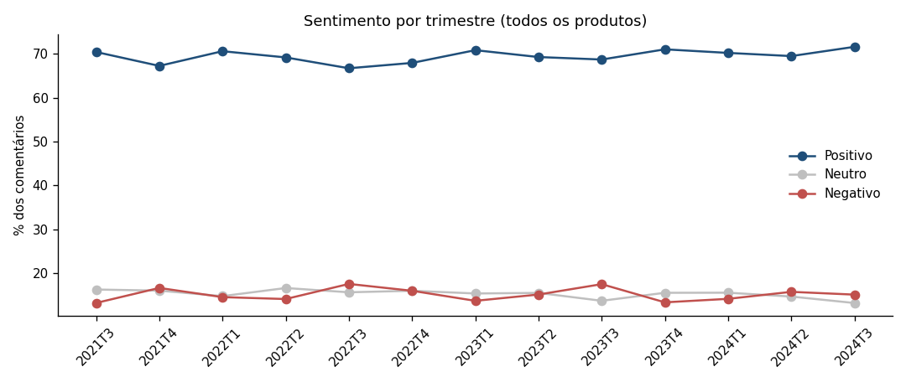
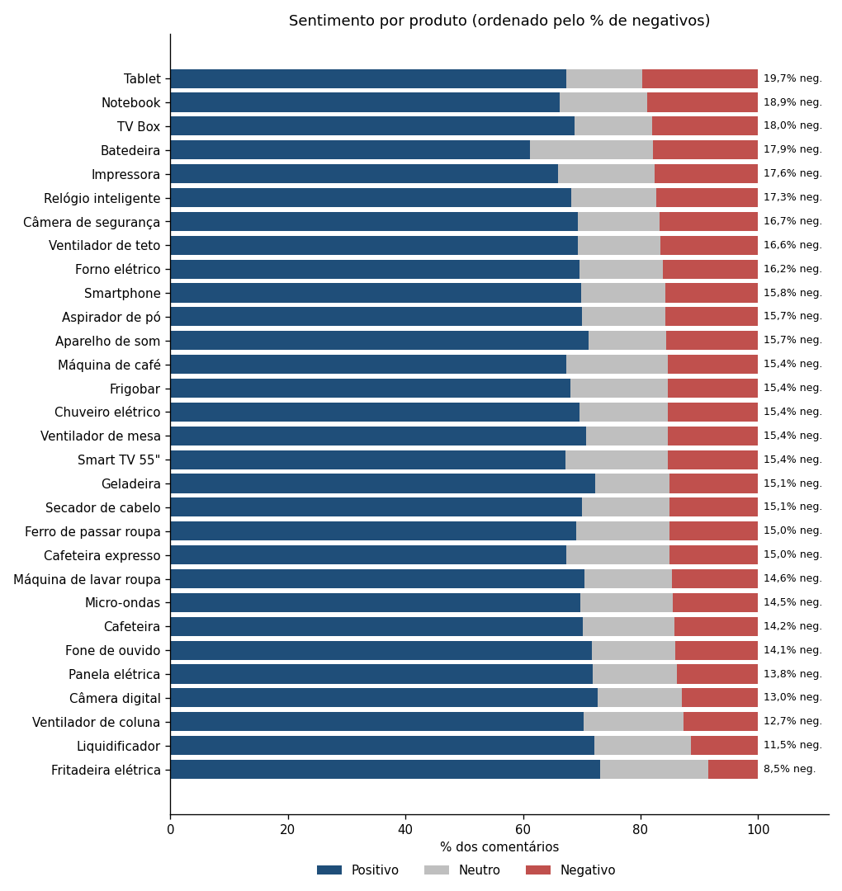
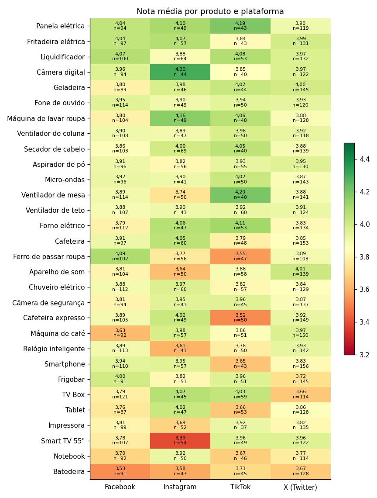
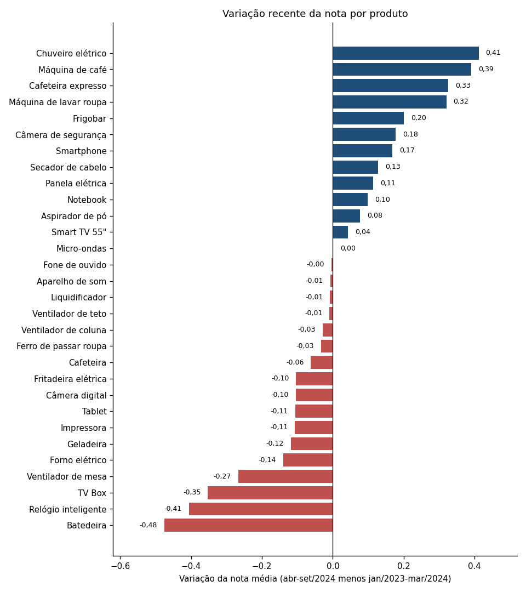
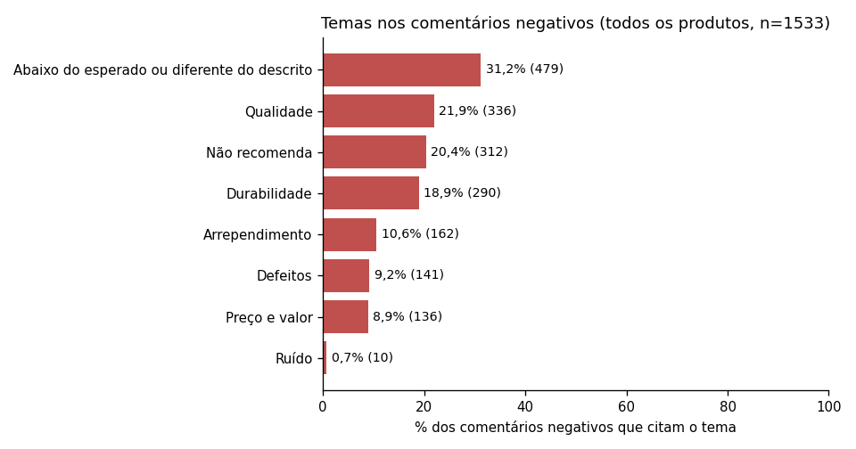

# Análise de feedbacks e sentimentos de todos os produtos

**Escopo:** as análises das Aulas [4.1](../analise_feedbacks.md) e [4.2](../analise_sentimentos.md), antes focadas na Batedeira, agora aplicadas aos **30 produtos** e aos **10.000 feedbacks** (30/08/2021 a 15/10/2024). O objetivo é deixar tudo pronto para alimentar um dashboard: os dados organizados estão em [dados_dashboard/](dados_dashboard/) e o dicionário em [dicionario_dados.md](dados_dashboard/dicionario_dados.md). **O dashboard ainda não foi construído.**

## 1. Método

- **Sentimento:** o mesmo classificador da Aula 4.2 (palavras-chave do Notion com regras de negação e frases de dois sentidos), aplicado a todos os comentários. Concorda com as notas em **99,89%** dos casos (9.989 de 10.000). As 11 divergências são 10 comentários de nota 2 com texto neutro e 1 de nota 4 (todos da Batedeira).
- **Temas:** identificados por palavras (durabilidade, qualidade, defeitos, expectativa e descrição, preço e valor, não recomenda, arrependimento, ruído, entre outros). Um comentário pode ter mais de um tema.
- **Testes estatísticos:** para cada produto, comparei a nota com a dos demais 29 (Mann-Whitney) e corrigi o resultado pelo número de testes (método de Benjamini-Hochberg, "p ajustado"), porque com 30 produtos algum deles aparece "diferente" por acaso.

## 2. Visão geral

| Indicador | Valor |
|---|---:|
| Feedbacks | 10.000 |
| Nota média | 3,88 |
| Positivos | 6.939 (69,39%) |
| Neutros | 1.528 (15,28%) |
| Negativos | 1.533 (15,33%) |
| Nota média, Eletrodomésticos (6.376 feedbacks) | 3,90 (14,63% negativos) |
| Nota média, Eletrônicos (3.624 feedbacks) | 3,86 (16,56% negativos) |

Entre plataformas, a nota média fica entre 3,87 (Facebook) e 3,91 (Instagram), e o percentual de negativos entre 14,72% e 15,63%: não há diferença relevante. O sentimento geral é estável ao longo do tempo: de 66,7% a 71,6% de positivos e de 13,3% a 17,6% de negativos por trimestre, sem tendência.

## 3. Todos os produtos: nota e sentimento

| Produto | Categoria | Feedbacks | Nota média (IC 95%) | % notas 1 e 2 | % positivo | % neutro | % negativo | Posição (nota) | Destaque estatístico |
|---|---|---:|---|---:|---:|---:|---:|---:|---|
| Panela elétrica | Eletrodomésticos | 305 | 4,02 (3,89 a 4,15) | 13,8% | 71,8% | 14,4% | 13,8% | 1º | Não |
| Fritadeira elétrica | Eletrodomésticos | 328 | 4,00 (3,89 a 4,11) | 8,5% | 73,2% | 18,3% | 8,5% | 2º | Não |
| Liquidificador | Eletrodomésticos | 349 | 4,00 (3,88 a 4,11) | 11,5% | 72,2% | 16,3% | 11,5% | 3º | Não |
| Câmera digital | Eletrônicos | 300 | 4,00 (3,87 a 4,12) | 13,0% | 72,7% | 14,3% | 13,0% | 4º | Não |
| Geladeira | Eletrodomésticos | 324 | 3,94 (3,82 a 4,07) | 15,1% | 72,2% | 12,7% | 15,1% | 5º | Não |
| Fone de ouvido | Eletrônicos | 333 | 3,93 (3,81 a 4,06) | 14,1% | 71,8% | 14,1% | 14,1% | 6º | Não |
| Máquina de lavar roupa | Eletrodomésticos | 329 | 3,92 (3,80 a 4,04) | 14,6% | 70,5% | 14,9% | 14,6% | 7º | Não |
| Ventilador de coluna | Eletrodomésticos | 323 | 3,92 (3,80 a 4,04) | 12,7% | 70,3% | 17,0% | 12,7% | 8º | Não |
| Secador de cabelo | Eletrodomésticos | 351 | 3,92 (3,79 a 4,04) | 15,1% | 70,1% | 14,8% | 15,1% | 9º | Não |
| Aspirador de pó | Eletrodomésticos | 337 | 3,91 (3,78 a 4,04) | 15,7% | 70,0% | 14,2% | 15,7% | 10º | Não |
| Micro-ondas | Eletrodomésticos | 330 | 3,91 (3,78 a 4,04) | 14,5% | 69,7% | 15,8% | 14,5% | 11º | Não |
| Ventilador de mesa | Eletrodomésticos | 345 | 3,90 (3,77 a 4,03) | 15,4% | 70,7% | 13,9% | 15,4% | 12º | Não |
| Ventilador de teto | Eletrodomésticos | 332 | 3,90 (3,77 a 4,03) | 16,6% | 69,3% | 14,2% | 16,6% | 13º | Não |
| Forno elétrico | Eletrodomésticos | 346 | 3,89 (3,77 a 4,02) | 16,2% | 69,7% | 14,2% | 16,2% | 14º | Não |
| Cafeteira | Eletrodomésticos | 358 | 3,89 (3,77 a 4,01) | 14,2% | 70,1% | 15,6% | 14,2% | 15º | Não |
| Ferro de passar roupa | Eletrodomésticos | 313 | 3,88 (3,75 a 4,01) | 15,0% | 69,0% | 16,0% | 15,0% | 16º | Não |
| Aparelho de som | Eletrônicos | 351 | 3,88 (3,75 a 4,01) | 15,7% | 71,2% | 13,1% | 15,7% | 17º | Não |
| Chuveiro elétrico | Eletrodomésticos | 358 | 3,87 (3,75 a 4,00) | 15,4% | 69,6% | 15,1% | 15,4% | 18º | Não |
| Câmera de segurança | Eletrônicos | 317 | 3,87 (3,74 a 4,01) | 16,7% | 69,4% | 13,9% | 16,7% | 19º | Não |
| Cafeteira expresso | Eletrodomésticos | 353 | 3,87 (3,75 a 3,99) | 15,0% | 67,4% | 17,6% | 15,0% | 20º | Não |
| Máquina de café | Eletrodomésticos | 350 | 3,87 (3,74 a 3,99) | 15,4% | 67,4% | 17,1% | 15,4% | 21º | Não |
| Relógio inteligente | Eletrônicos | 346 | 3,86 (3,73 a 3,99) | 17,3% | 68,2% | 14,5% | 17,3% | 22º | Não |
| Smartphone | Eletrônicos | 366 | 3,86 (3,74 a 3,98) | 15,8% | 69,9% | 14,2% | 15,8% | 23º | Não |
| Frigobar | Eletrodomésticos | 338 | 3,85 (3,72 a 3,97) | 15,4% | 68,0% | 16,6% | 15,4% | 24º | Não |
| TV Box | Eletrônicos | 339 | 3,82 (3,69 a 3,95) | 18,0% | 68,7% | 13,3% | 18,0% | 25º | Não |
| Tablet | Eletrônicos | 315 | 3,82 (3,69 a 3,96) | 19,7% | 67,3% | 13,0% | 19,7% | 26º | Não |
| Impressora | Eletrônicos | 323 | 3,81 (3,67 a 3,94) | 17,6% | 65,9% | 16,4% | 17,6% | 27º | Não |
| Smart TV 55" | Eletrônicos | 332 | 3,81 (3,68 a 3,93) | 15,4% | 67,2% | 17,5% | 15,4% | 28º | Não |
| Notebook | Eletrônicos | 302 | 3,76 (3,62 a 3,90) | 18,9% | 66,2% | 14,9% | 18,9% | 29º | Não |
| **Batedeira** | Eletrodomésticos | 307 | 3,62 (3,48 a 3,76) | 21,2% | 61,2% | 20,8% | 17,9% | 30º | Sim (p ajustado 0,001) |

Os gráficos [de nota média por produto](../graficos/03_media_por_produto.png) e de sentimento por produto mostram o mesmo resultado:

### O que a tabela mostra

1. **A Batedeira é o único produto que se destaca** (nota 3,62, p ajustado = 0,001). Os outros 29 produtos **não se distinguem** estatisticamente entre si (teste de Kruskal-Wallis sem a Batedeira: p = 0,80).
2. **O ranking entre os outros 29 produtos é, na prática, ruído.** O desvio entre as notas médias dos produtos (0,061) é igual ao que se esperaria só por acaso (0,065) com cerca de 330 feedbacks por produto. A Panela elétrica (4,02) não é melhor que a Fritadeira elétrica (4,00), e o Notebook (3,76) não é pior que a Impressora (3,81). Os intervalos de confiança se sobrepõem.
3. **Nota e percentual de negativos andam juntos** (correlação de Spearman de −0,79), mas não são iguais. A Batedeira é a última em nota, mas só a 4ª em negativos (17,92%), porque 10 comentários de nota 2 têm texto neutro. Tablet (19,68%), Notebook (18,87%) e TV Box (17,99%) têm mais comentários negativos.
4. **Produtos para acompanhar (menor nota e maior parcela de negativos):** Batedeira, Notebook, Tablet, TV Box e Impressora. Com exceção da Batedeira, as diferenças ainda são compatíveis com acaso.

## 4. Por plataforma

- Cada combinação produto × plataforma tem de 37 a 156 feedbacks (mediana de 78), o que dá pouca força aos testes.
- **Nenhum produto tem efeito de plataforma significativo** depois da correção: o menor p bruto é o da Smart TV 55" (0,032; p ajustado 0,64).
- Entre as combinações com 30 ou mais feedbacks, as menores notas são: Smart TV 55" no Instagram (3,39; 27,8% de negativos; n = 54), Cafeteira expresso no TikTok (3,52; n = 50), Batedeira no Facebook (3,53; n = 91), Ferro de passar roupa no TikTok (3,55; n = 47) e Batedeira no Instagram (3,58; n = 43). As maiores: Câmera digital no Instagram (4,30; n = 44), Ventilador de mesa no TikTok (4,20) e Panela elétrica no TikTok (4,19). São pontos de atenção, não conclusões.

## 5. Tendência recente: quem piorou?

Comparei o período recente (abr a set/2024) com o anterior (jan/2023 a mar/2024). **A nota geral ficou estável** (3,895 antes e 3,905 agora; p = 0,70). Por produto, 17 dos 30 caíram e 13 subiram.

**Maiores quedas**

| Produto | Nota antes | Nota recente | Variação | % negativos antes | % negativos recente | p | p ajustado |
|---|---:|---:|---:|---:|---:|---:|---:|
| Batedeira | 3,82 | 3,34 | -0,48 | 14,9% | 27,7% | 0,054 | 0,403 |
| Relógio inteligente | 3,99 | 3,58 | -0,41 | 15,6% | 17,5% | 0,014 | 0,321 |
| TV Box | 3,90 | 3,55 | -0,35 | 15,2% | 28,6% | 0,198 | 0,585 |
| Ventilador de mesa | 4,08 | 3,81 | -0,27 | 11,4% | 17,0% | 0,089 | 0,446 |
| Forno elétrico | 3,95 | 3,81 | -0,14 | 15,9% | 15,9% | 0,214 | 0,585 |
| Geladeira | 3,95 | 3,83 | -0,12 | 13,7% | 18,8% | 0,639 | 0,929 |

**Maiores altas**

| Produto | Nota antes | Nota recente | Variação | % negativos antes | % negativos recente | p | p ajustado |
|---|---:|---:|---:|---:|---:|---:|---:|
| Chuveiro elétrico | 3,87 | 4,28 | 0,41 | 17,8% | 7,4% | 0,022 | 0,321 |
| Máquina de café | 3,81 | 4,20 | 0,39 | 15,9% | 10,0% | 0,032 | 0,321 |
| Cafeteira expresso | 3,71 | 4,04 | 0,33 | 19,3% | 7,7% | 0,113 | 0,484 |
| Máquina de lavar roupa | 3,85 | 4,17 | 0,32 | 13,6% | 8,5% | 0,073 | 0,438 |
| Frigobar | 3,89 | 4,09 | 0,20 | 10,7% | 13,8% | 0,245 | 0,613 |

**Leitura:** a Batedeira tem a maior queda (−0,48; e +12,77 pontos percentuais de negativos). Relógio inteligente, TV Box e Ventilador de mesa vêm a seguir. **Nenhuma variação é significativa depois da correção** (menor p ajustado = 0,32). Como são 30 testes, esperam-se alguns p brutos abaixo de 0,05 só por acaso, e foram 3. Por isso trato essas variações como **lista de observação**, para acompanhar nos próximos meses, não como diagnóstico.

O [mapa de calor produto × trimestre](graficos/16_mapa_calor_produto_trimestre.png) mostra a evolução completa de cada produto.

## 6. Temas dos comentários

### Negativos (1.533 comentários, todos os produtos)

| Tema | Comentários | % dos negativos |
|---|---:|---:|
| Abaixo do esperado ou diferente do descrito | 479 | 31,2% |
| Qualidade | 336 | 21,9% |
| Não recomenda | 312 | 20,4% |
| Durabilidade | 290 | 18,9% |
| Arrependimento | 162 | 10,6% |
| Defeitos | 141 | 9,2% |
| Preço e valor | 136 | 8,9% |
| Ruído | 10 | 0,7% |

- **Os comentários dos outros 29 produtos são genéricos:** a base tem só 1.177 comentários diferentes em 10.000 feedbacks, repetidos entre produtos ("Não compraria novamente. Produto não durável", "Quebra facilmente"...). Não há queixas específicas de cada produto.
- **Os temas específicos aparecem só na Batedeira:** **ruído** (10 comentários, todos da Batedeira), design e facilidade de uso (todos da Batedeira). Por isso, para os demais produtos, o dashboard só consegue separar problemas genéricos (qualidade, durabilidade, expectativa, preço).
- **Durabilidade:** a Batedeira tem a maior parcela entre os negativos (41,8%), seguida de Ventilador de mesa (28,3%) e Máquina de lavar roupa (25,0%). A média geral é 18,9%.
- **Expectativa e descrição** (produto abaixo do esperado ou diferente do descrito) é o tema mais frequente nos negativos (31,2%) e passa de 40% em Ventilador de coluna, Chuveiro elétrico, Geladeira e Panela elétrica. Indica descrições de anúncio que podem criar expectativas acima do produto.

### Neutros (1.528) e positivos (6.939)

**Neutros (1.528)**

| Tema | Comentários | % dos neutros |
|---|---:|---:|
| Produto básico ou comum | 786 | 51,4% |
| Expectativa e descrição | 441 | 28,9% |
| Desempenho e eficiência | 297 | 19,4% |
| Preço e valor | 150 | 9,8% |
| Marca | 139 | 9,1% |
| Entrega | 5 | 0,3% |

**Positivos (6.939)**

| Tema | Comentários | % dos positivos |
|---|---:|---:|
| Recomendação | 2.140 | 30,8% |
| Qualidade | 2.028 | 29,2% |
| Desempenho e eficiência | 1.432 | 20,6% |
| Expectativa e descrição | 1.383 | 19,9% |
| Uso diário e praticidade | 701 | 10,1% |
| Preço e valor | 683 | 9,8% |
| Entrega | 676 | 9,7% |

## 7. Anomalia: seguidores e nota no Ventilador de teto

Na base toda não há relação entre o número de seguidores do autor e a nota (correlação de −0,002). Mas **no Ventilador de teto** a nota cai quando o autor tem mais seguidores (correlação de Spearman de −0,20; p = 0,0002, significativo mesmo com a correção para 30 produtos):

| Faixa de seguidores | Feedbacks | Nota média |
|---|---:|---:|
| Até 24.750 | 83 | 4,16 |
| 24.862 a 48.736 | 83 | 4,11 |
| 49.401 a 71.412 | 83 | 3,71 |
| 71.433 ou mais | 83 | 3,63 |

O padrão não aparece nas plataformas (3,88 a 3,92). É o único produto com esse comportamento, e vale a pena investigar, porque autores com mais seguidores têm mais alcance.

## 8. O que isso significa para o dashboard

| Ponto | Recomendação |
|---|---|
| Rankings entre produtos | Mostrar o **intervalo de confiança** e o número de feedbacks, para não induzir leitura de diferença onde há só ruído |
| Destaque principal | Batedeira (único outlier) e lista de observação de tendência (Batedeira, Relógio inteligente, TV Box, Ventilador de mesa) |
| Filtros úteis | Produto, categoria, plataforma, período (trimestre ou mês), sentimento e tema |
| Temas | Disponíveis só em nível genérico, exceto Batedeira |
| Alerta de amostra | Cruzamentos produto × plataforma × trimestre têm poucos feedbacks por célula: usar o filtro de mínimo de 30 feedbacks |

## 9. Limites

- Os feedbacks por produto e plataforma são poucos (de 37 a 156), o que reduz a força dos testes.
- Os comentários dos outros 29 produtos são padronizados, então a análise de temas é limitada. Em texto real de clientes, a classificação por palavras-chave perde precisão.
- A taxa de concordância com as notas (99,89%) vem de regras ajustadas na própria base.
- Os meses de ago/2021, set/2021 e out/2024 são parciais.
- A lista de observação de tendência não tem significância estatística depois da correção por múltiplos testes.
