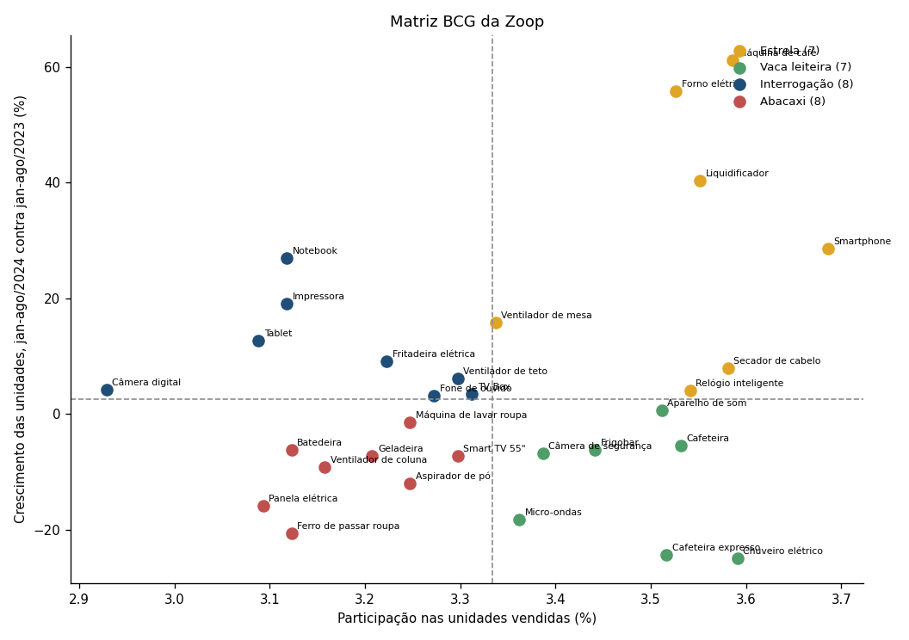
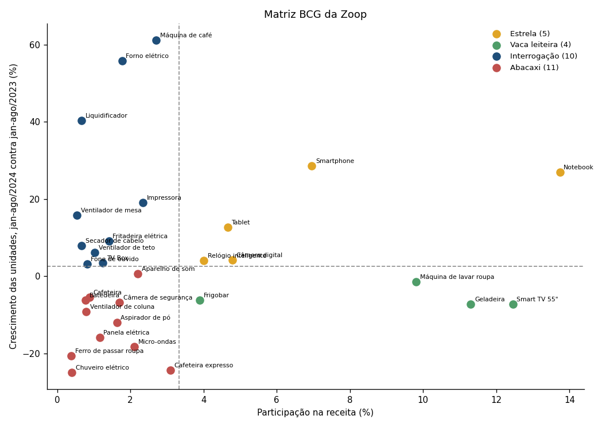
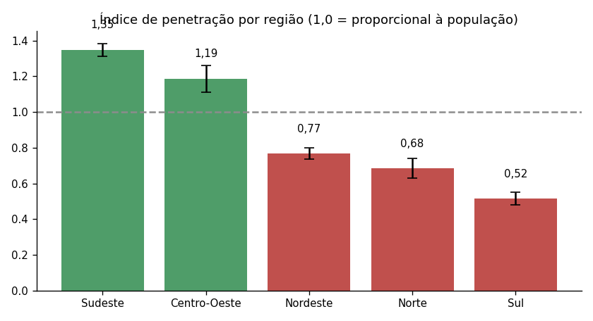
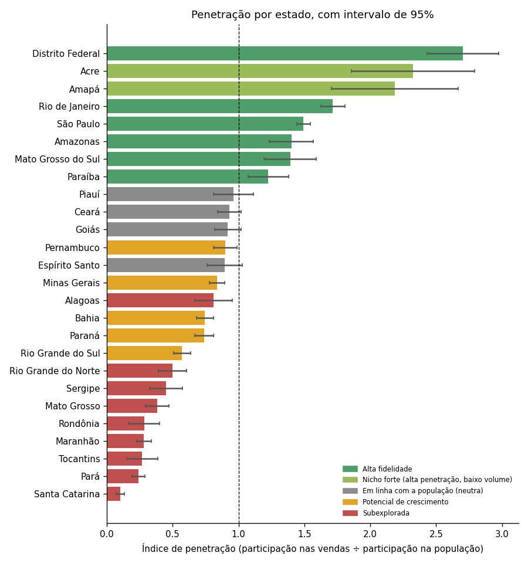
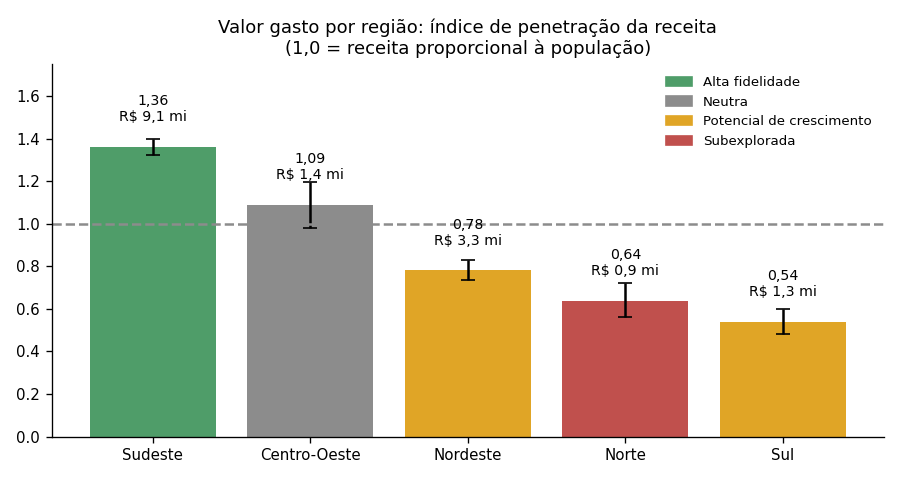
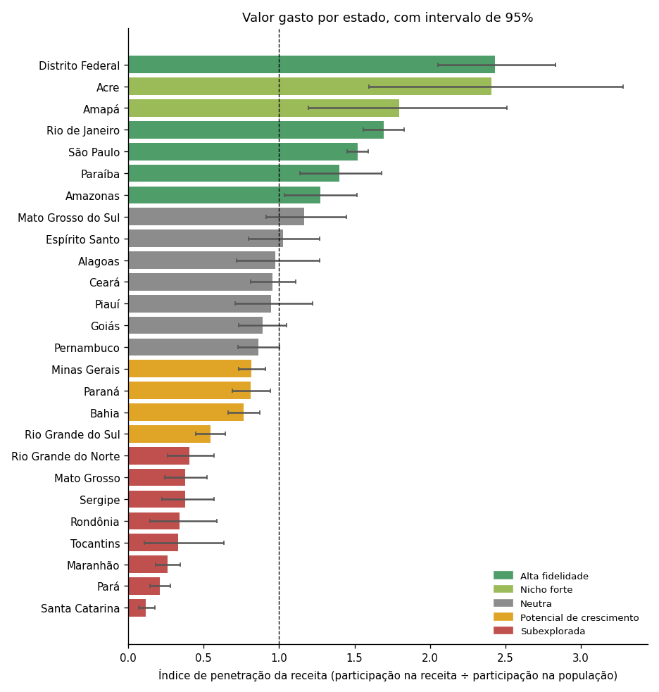
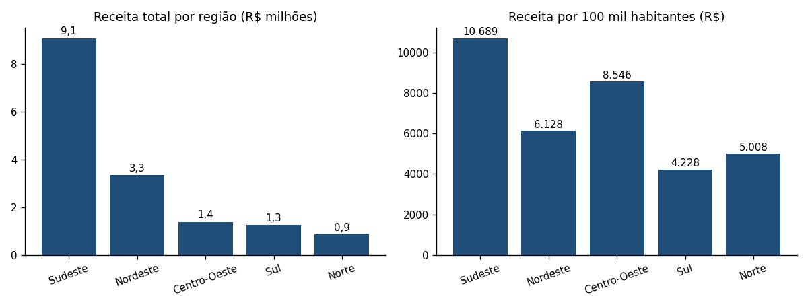

# Aula 5.2 · Mapeamento de oportunidades: Matriz BCG e análise RFM por região

**Base:** `Vendas Zopp.xlsx` (20/08/2021 a 19/08/2024) e, para a população, o **Censo 2022 do IBGE** (população por estado). Os dados prontos para dashboard estão em [dados/](dados/): `bcg_produtos.csv`, `rfm_regiao.csv` e `rfm_uf.csv`.

---

## Prompt 1 · Matriz BCG

### Como foi calculada

- **Participação:** parcela de cada produto nas unidades vendidas da Zoop (como pede o prompt). Como a base só tem as vendas da própria Zoop (não há concorrentes), é a participação **dentro do portfólio**. Corte de "alta participação": 3,33% (1 ÷ 30 produtos, a média).
- **Crescimento:** unidades de jan a 19/ago de 2024 contra o mesmo período de 2023 (janela idêntica, para não comparar anos com tamanhos diferentes). Corte de "alto crescimento": o crescimento total da Zoop na mesma janela, **+2,5%** (4.203 para 4.308 unidades). Mostro também o crescimento de 2023 contra 2022 (−1,5% no total).
- **Variante por receita:** como as vendas por produto são quase iguais, repeti a classificação com a participação na **receita**, que é onde os produtos realmente diferem.
- **Teste de significância:** para cada produto, comparei seu crescimento com o crescimento total (teste binomial, com correção para 30 produtos).

### Classificação dos 30 produtos

| Produto | Participação (unidades) | Crescimento jan-ago/24 vs 23 | Crescimento 2023 vs 2022 | BCG por unidades | Participação (receita) | BCG por receita | Crescimento significativo? |
|---|---:|---:|---:|---|---:|---|---|
| Smartphone | 3,69% | 28,7% | 2,9% | Estrela | 6,96% | Estrela | Não |
| Chuveiro elétrico | 3,59% | -25,0% | 29,3% | Vaca leiteira | 0,40% | Abacaxi | Sim |
| Máquina de café | 3,59% | 61,3% | -25,9% | Estrela | 2,70% | Interrogação | Sim |
| Secador de cabelo | 3,58% | 8,0% | 2,6% | Estrela | 0,67% | Interrogação | Não |
| Liquidificador | 3,55% | 40,3% | -19,8% | Estrela | 0,67% | Interrogação | Sim |
| Relógio inteligente | 3,54% | 4,1% | -8,9% | Estrela | 4,01% | Estrela | Não |
| Cafeteira | 3,53% | -5,5% | 4,2% | Vaca leiteira | 0,88% | Abacaxi | Não |
| Forno elétrico | 3,53% | 55,9% | -9,1% | Estrela | 1,77% | Interrogação | Sim |
| Cafeteira expresso | 3,52% | -24,3% | 7,5% | Vaca leiteira | 3,09% | Abacaxi | Sim |
| Aparelho de som | 3,51% | 0,7% | 11,2% | Vaca leiteira | 2,21% | Abacaxi | Não |
| Frigobar | 3,44% | -6,2% | -13,1% | Vaca leiteira | 3,90% | Vaca leiteira | Não |
| Câmera de segurança | 3,39% | -6,8% | -22,1% | Vaca leiteira | 1,70% | Abacaxi | Não |
| Micro-ondas | 3,36% | -18,3% | -6,7% | Vaca leiteira | 2,11% | Abacaxi | Não |
| Ventilador de mesa | 3,34% | 15,8% | -5,3% | Estrela | 0,54% | Interrogação | Não |
| TV Box | 3,31% | 3,5% | 12,6% | Interrogação | 1,25% | Interrogação | Não |
| Smart TV 55" | 3,30% | -7,2% | 18,2% | Abacaxi | 12,45% | Vaca leiteira | Não |
| Ventilador de teto | 3,30% | 6,2% | -22,9% | Interrogação | 1,03% | Interrogação | Não |
| Fone de ouvido | 3,27% | 3,1% | -12,1% | Interrogação | 0,82% | Interrogação | Não |
| Máquina de lavar roupa | 3,25% | -1,5% | 9,0% | Abacaxi | 9,81% | Vaca leiteira | Não |
| Aspirador de pó | 3,25% | -12,1% | -1,8% | Abacaxi | 1,63% | Abacaxi | Não |
| Fritadeira elétrica | 3,22% | 9,2% | 11,9% | Interrogação | 1,42% | Interrogação | Não |
| Geladeira | 3,21% | -7,2% | -6,7% | Abacaxi | 11,30% | Vaca leiteira | Não |
| Ventilador de coluna | 3,16% | -9,2% | 7,6% | Abacaxi | 0,79% | Abacaxi | Não |
| Batedeira | 3,12% | -6,2% | 25,4% | Abacaxi | 0,78% | Abacaxi | Não |
| Ferro de passar roupa | 3,12% | -20,7% | 4,2% | Abacaxi | 0,39% | Abacaxi | Não |
| Impressora | 3,12% | 19,0% | 15,4% | Interrogação | 2,35% | Interrogação | Não |
| Notebook | 3,12% | 27,0% | -20,2% | Interrogação | 13,74% | Estrela | Não |
| Panela elétrica | 3,09% | -15,9% | -1,4% | Abacaxi | 1,16% | Abacaxi | Não |
| Tablet | 3,09% | 12,7% | -0,5% | Interrogação | 4,66% | Estrela | Não |
| Câmera digital | 2,93% | 4,2% | -1,0% | Interrogação | 4,79% | Estrela | Não |

### Resultado

| Quadrante | Por unidades | Por receita |
|---|---|---|
| **Estrelas** | Smartphone, Máquina de café, Secador de cabelo, Liquidificador, Relógio inteligente, Forno elétrico, Ventilador de mesa | Notebook, Smartphone, Câmera digital, Tablet, Relógio inteligente |
| **Vacas leiteiras** | Chuveiro elétrico, Cafeteira, Cafeteira expresso, Aparelho de som, Frigobar, Câmera de segurança, Micro-ondas | Smart TV 55", Geladeira, Máquina de lavar roupa, Frigobar |
| **Interrogações** | TV Box, Ventilador de teto, Fone de ouvido, Fritadeira elétrica, Impressora, Notebook, Tablet, Câmera digital | Máquina de café, Impressora, Forno elétrico, Fritadeira elétrica, TV Box, Ventilador de teto, Fone de ouvido, Secador de cabelo, Liquidificador, Ventilador de mesa |
| **Abacaxis** | Smart TV 55", Máquina de lavar roupa, Aspirador de pó, Geladeira, Ventilador de coluna, Batedeira, Ferro de passar roupa, Panela elétrica | Cafeteira expresso, Aparelho de som, Micro-ondas, Câmera de segurança, Aspirador de pó, Panela elétrica, Cafeteira, Ventilador de coluna, Batedeira, Chuveiro elétrico, Ferro de passar roupa |

### Como ler a matriz com cuidado

1. **A participação por unidades quase não diferencia os produtos** (de 2,93% a 3,69%). A classificação por unidades muda de quadrante por décimos de ponto percentual. **A versão por receita é a mais útil para decidir.**
2. **O crescimento é muito instável.** A correlação entre o crescimento de 2024 e o de 2023 é **negativa (−0,46)**: os produtos que cresceram em 2023 tendem a cair em 2024 e vice-versa (por exemplo, Máquina de café: −25,9% em 2023 e +61,3% em 2024; Chuveiro elétrico: +29,3% e −25,0%). Em boa parte é recuperação, não tendência.
3. **Só 5 produtos têm crescimento significativo** em relação ao total: Máquina de café (+61,3%), Forno elétrico (+55,9%) e Liquidificador (+40,3%) subiram; Chuveiro elétrico (−25,0%) e Cafeteira expresso (−24,3%) caíram. Nos demais, a diferença é compatível com o acaso.
4. **Crescimento consistente** (acima do total nos dois períodos): **Smartphone, Tablet, Câmera digital, Impressora, TV Box, Fritadeira elétrica e Secador de cabelo**.

### Oportunidades e ações por quadrante

| Quadrante (por receita) | Produtos | Ações sugeridas |
|---|---|---|
| **Estrelas** | Notebook, Smartphone, Câmera digital, Tablet, Relógio inteligente | Concentrar campanhas e recomendações aqui (são 34,2% da receita e têm crescimento consistente, exceto Notebook e Relógio). Garantir estoque e expandir para regiões sub-exploradas (seção RFM). Notebook e Tablet têm o maior percentual de notas baixas (18,9% e 19,7%): acompanhar a oferta com garantia |
| **Vacas leiteiras** | Smart TV 55", Geladeira, Máquina de lavar roupa, Frigobar | Produtos de ticket alto e receita estável (37,5% da receita, sem crescimento): proteger a margem, evitar descontos gerais e usar como âncora de cross-sell |
| **Interrogações** | Máquina de café, Secador de cabelo, Liquidificador, Forno elétrico, Fritadeira elétrica, Ventilador de mesa, Impressora, TV Box, Ventilador de teto, Fone de ouvido | Baixa receita e crescimento instável: testar com ações regionais de baixo custo antes de investir; bons candidatos por nota alta: Fritadeira elétrica (4,00) e Liquidificador (4,00) |
| **Abacaxis** | Cafeteira expresso, Aparelho de som, Micro-ondas, Câmera de segurança, Aspirador de pó, Panela elétrica, Ventilador de coluna, Cafeteira, Batedeira, Ferro de passar roupa, Chuveiro elétrico | Pouca receita e sem crescimento. Reposicionar com preço ou combo, reduzir estoque ou retirar do portfólio os de pior desempenho. **Batedeira:** nota significativamente baixa (3,62), não impulsionar até corrigir os problemas (ver o [plano 5W2H](../04_sentimento_batedeiras/plano_5w2h_batedeira.md)) |

---

## Prompt 2 · Mapeamento de oportunidades por região com RFM

### Adaptação necessária

A RFM clássica mede **cada cliente**: quando comprou pela última vez (recência), quantas vezes (frequência) e quanto gastou (monetização). **A base não tem identificador de cliente**, então calculei a RFM **por localidade** (região e estado):

- **Recência:** dias desde a última venda na localidade (até 20/08/2024).
- **Frequência:** número de vendas nos últimos 12 meses (20/08/2023 a 19/08/2024).
- **Monetização:** receita nos últimos 12 meses.

Como todas as regiões vendem quase todos os dias (a recência é de 1 a 4 dias), a recência não diferencia regiões. Para encontrar oportunidades acrescentei o **índice de penetração**: a participação da localidade nas vendas dividida pela participação na população (Censo 2022). **Índice de 1,0 significa vendas proporcionais à população.** O intervalo de confiança de 95% indica se a diferença para 1,0 é real.

**Classificação (regra aplicada aos estados e às regiões):**
- **Alta fidelidade:** índice acima de 1,0 (intervalo todo acima) e frequência acima da mediana.
- **Potencial de crescimento:** índice abaixo de 1,0 (intervalo todo abaixo) e frequência acima da mediana: é um mercado grande, mas sub-aproveitado.
- **Subexplorada:** índice abaixo de 1,0 e frequência abaixo da mediana.
- **Nicho forte:** índice acima de 1,0 e frequência abaixo da mediana (acrescentei esta classe porque o prompt não a prevê, e há estados nessa situação).
- **Neutra:** o intervalo inclui 1,0.

### Por região

| Região | Última venda | Recência (dias) | Frequência (12 meses) | Monetização (12 meses, R$) | Ticket por venda (R$) | % da população | % das vendas | Índice de penetração (IC 95%) | Variação 12m | Classe |
|---|---|---:|---:|---:|---:|---:|---:|---|---:|---|
| Sudeste | 19/08/2024 | 1 | 1.918 | 3.080.244 | 1.606 | 41,8% | 56,4% | 1,35 (1,31 a 1,38) | 4,8% | **Alta fidelidade** |
| Centro-Oeste | 16/08/2024 | 4 | 314 | 396.962 | 1.264 | 8,0% | 9,5% | 1,19 (1,11 a 1,26) | -0,9% | **Alta fidelidade** |
| Nordeste | 19/08/2024 | 1 | 677 | 1.171.820 | 1.731 | 26,9% | 20,7% | 0,77 (0,73 a 0,80) | -4,5% | **Potencial de crescimento** |
| Norte | 17/08/2024 | 3 | 186 | 287.033 | 1.543 | 8,5% | 5,8% | 0,68 (0,63 a 0,74) | -3,1% | **Subexplorada** |
| Sul | 18/08/2024 | 2 | 265 | 484.176 | 1.827 | 14,7% | 7,6% | 0,52 (0,48 a 0,55) | 14,7% | **Subexplorada** |

**Leitura:**
- **Sudeste** (56,4% das vendas, 41,8% da população) e **Centro-Oeste** (9,5% e 8,0%) vendem acima do peso populacional.
- **Sul** é a mais sub-explorada: 14,7% da população e só 7,6% das vendas (índice de 0,52). Mesmo assim cresceu **14,7%** nos últimos 12 meses.
- **Nordeste** (índice de 0,77) e **Norte** (0,68) vendem abaixo do esperado, e caíram no último ano (−4,5% e −3,1%).
- O **ticket médio por venda** não difere entre regiões (de R$ 1.264 a R$ 1.827; p = 0,29), então a oportunidade é de **volume**, não de preço.
- No total, os últimos 12 meses tiveram 3.360 vendas contra 3.279 nos 12 anteriores (+2,5%).

### Por estado

| Estado | Região | Recência (dias) | Frequência (12m) | Monetização (12m, R$) | % pop. | % vendas | Índice (IC 95%) | Classe |
|---|---|---:|---:|---:|---:|---:|---|---|
| Distrito Federal | Centro-Oeste | 4 | 113 | 129.148 | 1,39% | 3,75% | 2,70 (2,43 a 2,98) | Alta fidelidade |
| Acre | Norte | 11 | 36 | 55.165 | 0,41% | 0,95% | 2,32 (1,86 a 2,79) | Nicho forte (alta penetração, baixo volume) |
| Amapá | Norte | 3 | 30 | 35.025 | 0,36% | 0,79% | 2,19 (1,70 a 2,67) | Nicho forte (alta penetração, baixo volume) |
| Rio de Janeiro | Sudeste | 2 | 459 | 662.354 | 7,91% | 13,56% | 1,72 (1,62 a 1,81) | Alta fidelidade |
| São Paulo | Sudeste | 1 | 1.118 | 1.859.056 | 21,87% | 32,66% | 1,49 (1,44 a 1,54) | Alta fidelidade |
| Amazonas | Norte | 3 | 87 | 136.097 | 1,94% | 2,72% | 1,40 (1,23 a 1,57) | Alta fidelidade |
| Mato Grosso do Sul | Centro-Oeste | 4 | 62 | 84.156 | 1,36% | 1,89% | 1,39 (1,19 a 1,59) | Alta fidelidade |
| Paraíba | Nordeste | 3 | 79 | 171.614 | 1,96% | 2,40% | 1,23 (1,07 a 1,38) | Alta fidelidade |
| Piauí | Nordeste | 11 | 55 | 98.663 | 1,61% | 1,55% | 0,96 (0,81 a 1,11) | Em linha com a população (neutra) |
| Ceará | Nordeste | 1 | 131 | 228.478 | 4,33% | 4,03% | 0,93 (0,84 a 1,02) | Em linha com a população (neutra) |
| Goiás | Centro-Oeste | 4 | 114 | 149.066 | 3,47% | 3,19% | 0,92 (0,82 a 1,02) | Em linha com a população (neutra) |
| Pernambuco | Nordeste | 3 | 140 | 231.338 | 4,46% | 4,01% | 0,90 (0,81 a 0,99) | Potencial de crescimento |
| Espírito Santo | Sudeste | 1 | 59 | 111.124 | 1,89% | 1,69% | 0,90 (0,76 a 1,03) | Em linha com a população (neutra) |
| Minas Gerais | Sudeste | 5 | 282 | 447.710 | 10,11% | 8,46% | 0,84 (0,78 a 0,89) | Potencial de crescimento |
| Alagoas | Nordeste | 10 | 37 | 82.570 | 1,54% | 1,25% | 0,81 (0,67 a 0,95) | Subexplorada |
| Bahia | Nordeste | 1 | 164 | 251.532 | 6,96% | 5,19% | 0,75 (0,68 a 0,81) | Potencial de crescimento |
| Paraná | Sul | 3 | 146 | 273.818 | 5,64% | 4,16% | 0,74 (0,67 a 0,81) | Potencial de crescimento |
| Rio Grande do Sul | Sul | 2 | 105 | 168.735 | 5,36% | 3,06% | 0,57 (0,51 a 0,63) | Potencial de crescimento |
| Rio Grande do Norte | Nordeste | 11 | 29 | 46.895 | 1,63% | 0,81% | 0,50 (0,39 a 0,61) | Subexplorada |
| Sergipe | Nordeste | 12 | 12 | 12.930 | 1,09% | 0,49% | 0,45 (0,32 a 0,58) | Subexplorada |
| Mato Grosso | Centro-Oeste | 86 | 25 | 34.592 | 1,80% | 0,69% | 0,38 (0,29 a 0,47) | Subexplorada |
| Rondônia | Norte | 59 | 5 | 15.990 | 0,78% | 0,22% | 0,28 (0,16 a 0,40) | Subexplorada |
| Maranhão | Nordeste | 8 | 30 | 47.800 | 3,34% | 0,94% | 0,28 (0,22 a 0,34) | Subexplorada |
| Tocantins | Norte | 19 | 4 | 3.691 | 0,74% | 0,20% | 0,27 (0,15 a 0,39) | Subexplorada |
| Pará | Norte | 21 | 24 | 41.065 | 4,00% | 0,96% | 0,24 (0,19 a 0,29) | Subexplorada |
| Santa Catarina | Sul | 4 | 14 | 41.623 | 3,75% | 0,38% | 0,10 (0,07 a 0,13) | Subexplorada |
| Roraima | Norte | – | 0 | 0 | 0,31% | 0,00% | 0,00 | Sem vendas na base |

**Resumo da classificação (26 estados com vendas):** 6 de alta fidelidade (DF, RJ, SP, AM, MS e PB), 2 nichos fortes (AC e AP), 5 com potencial de crescimento (PE, MG, BA, PR e RS), 9 subexplorados (AL, RN, SE, MT, RO, MA, TO, PA e SC) e 4 neutros (PI, CE, GO e ES). **Roraima não tem nenhuma venda.**

### Tamanho da oportunidade

Se os estados claramente sub-indexados chegassem à penetração média nacional (índice 1,0), a Zoop venderia mais:

| Estado | Região | Vendas atuais | Vendas esperadas com a penetração nacional | Diferença (vendas) | Diferença (receita, R$) |
|---|---|---:|---:|---:|---:|
| Santa Catarina | Sul | 38 | 375 | 337 | 536.960 |
| Pará | Norte | 96 | 400 | 304 | 484.502 |
| Maranhão | Nordeste | 94 | 334 | 240 | 382.207 |
| Rio Grande do Sul | Sul | 306 | 536 | 230 | 366.578 |
| Bahia | Nordeste | 519 | 696 | 177 | 282.802 |
| Minas Gerais | Sudeste | 846 | 1.011 | 165 | 263.771 |
| Paraná | Sul | 416 | 564 | 148 | 235.258 |
| Mato Grosso | Centro-Oeste | 69 | 180 | 111 | 177.247 |
| Rio Grande do Norte | Nordeste | 81 | 163 | 82 | 130.166 |
| Sergipe | Nordeste | 49 | 109 | 60 | 95.393 |
| Rondônia | Norte | 22 | 78 | 56 | 89.073 |
| Tocantins | Norte | 20 | 74 | 54 | 86.786 |
| Pernambuco | Nordeste | 401 | 446 | 45 | 71.875 |
| Alagoas | Nordeste | 125 | 154 | 29 | 46.261 |
| **Total** | | **3.082** | **5.119** | **2.037** | **3.248.878** |

**Em resumo:** cerca de **2.037 vendas a mais, ou R$ 3,25 milhões** (20,4% acima do total atual), ao ticket médio de R$ 1.594,56. Por região: Sul 714 vendas (Santa Catarina, 337, é o maior caso, com índice de 0,10), Nordeste 633, Norte 414, Sudeste 165 (Minas Gerais) e Centro-Oeste 111 (Mato Grosso). **É um teto teórico**: ignora diferenças de renda e de presença de lojas entre estados.

### Variante por valor gasto (monetização)

A mesma análise, medindo o **valor gasto** (receita) em vez do número de vendas: índice de penetração da receita = participação na receita ÷ participação na população. O intervalo de 95% vem de 2.000 reamostragens das vendas. A classificação usa a monetização dos últimos 12 meses para separar mercados grandes e pequenos.

| Região | Receita total (R$) | % da receita | % da população | Índice (IC 95%) | Receita por 100 mil hab. (R$) | Classe pela receita | Classe pelas vendas |
|---|---:|---:|---:|---|---:|---|---|
| Sudeste | 9.068.897 | 56,9% | 41,8% | 1,36 (1,32 a 1,40) | 10.689 | Alta fidelidade | Alta fidelidade |
| Centro-Oeste | 1.392.132 | 8,7% | 8,0% | 1,09 (0,98 a 1,20) | 8.546 | Neutra | Alta fidelidade |
| Nordeste | 3.349.666 | 21,0% | 26,9% | 0,78 (0,73 a 0,83) | 6.128 | Potencial de crescimento | Potencial de crescimento |
| Norte | 869.128 | 5,4% | 8,5% | 0,64 (0,56 a 0,72) | 5.008 | Subexplorada | Subexplorada |
| Sul | 1.265.739 | 7,9% | 14,7% | 0,54 (0,48 a 0,60) | 4.228 | Potencial de crescimento | Subexplorada |

**O que muda em relação à análise por vendas:**
- **O quadro geral é o mesmo:** a correlação entre os índices por vendas e por receita nos estados é de 0,98. Sudeste vende acima do peso da população, e Sul, Norte e Nordeste abaixo.
- **Centro-Oeste deixa de ser "alta fidelidade"** e passa a neutro: o intervalo (0,98 a 1,20) inclui 1,0.
- **O Sul passa de "subexplorada" a "potencial de crescimento":** seu ticket por venda é o mais alto (R$ 1.827), o que eleva a receita para além do número de vendas e o coloca acima da mediana de monetização. Continua a região com a menor receita por habitante (R$ 4.228 por 100 mil, contra R$ 10.689 no Sudeste).
- **Três estados mudam de classe** por terem o intervalo da receita incluindo 1,0: Alagoas (de subexplorada a neutra), Mato Grosso do Sul (de alta fidelidade a neutro) e Pernambuco (de potencial de crescimento a neutro).
- **Os casos extremos se mantêm:** Distrito Federal (2,43), Acre (2,40), Amapá (1,80), Rio de Janeiro (1,69) e São Paulo (1,52) no topo; Santa Catarina (0,12), Pará (0,21), Maranhão (0,26), Tocantins (0,33) e Rondônia (0,34) na base.
- **Resumo dos 26 estados pela receita:** 5 de alta fidelidade, 2 nichos fortes, 4 com potencial de crescimento, 7 neutros e 8 subexplorados.

As colunas da variante estão em `dados/rfm_regiao.csv` e `dados/rfm_uf.csv` (`Receita_total`, `Pct_receita`, `Indice_receita`, `IC_inf_r`, `IC_sup_r`, `Receita_por_100mil` e `Classe_receita`).

### Recência por cidade

Todas as 92 cidades tiveram vendas nos últimos 12 meses. As com maior tempo sem comprar:

| Cidade | Estado | Vendas (total) | Última venda | Recência (dias) |
|---|---|---:|---|---:|
| Cotia | São Paulo | 20 | 08/04/2024 | 134 |
| Caxias do Sul | Rio Grande do Sul | 23 | 18/04/2024 | 124 |
| Guarujá | São Paulo | 40 | 22/05/2024 | 90 |
| Cuiabá | Mato Grosso | 69 | 26/05/2024 | 86 |
| Vitória | Espírito Santo | 32 | 08/06/2024 | 73 |
| Serra | Espírito Santo | 28 | 15/06/2024 | 66 |

Só 4 cidades passam de 80 dias sem vendas (Cotia, Caxias do Sul, Guarujá e Cuiabá), todas com poucas vendas no histórico: são casos pontuais para reativação, não um problema geral.

### Estratégias por classe

| Classe | Estados | Estratégia |
|---|---|---|
| **Alta fidelidade** | DF, RJ, SP, AM, MS, PB | Manter e recompensar: programa de fidelidade, ofertas de ticket alto (Notebook, Smart TV, Geladeira) e cross-sell. Exige registrar o cliente (a base não tem) |
| **Potencial de crescimento** | PE, MG, BA, PR, RS | Mercados grandes e abaixo do esperado: campanhas regionais com os produtos estrela por receita e parcerias locais; meta de levar o índice a 1,0 |
| **Subexploradas** | SC, PA, MA, TO, RO, MT, SE, RN, AL (e Roraima, sem vendas) | Estratégia de entrada: piloto regional com produtos de ticket baixo e médio e de boa avaliação, entrega e atendimento locais, e acompanhamento do índice trimestral |
| **Nichos fortes** | AC, AP | Poucos clientes, mas vendas acima da população: manter a oferta e evitar ruptura de estoque |

### Conclusões da Aula 5.2

1. **O produto é pouco relevante para diferenciar; a receita depende do preço.** Notebook, Smartphone, Câmera digital, Tablet e Relógio inteligente são as estrelas por receita.
2. **A maior oportunidade é geográfica:** Sul, Nordeste e Norte vendem abaixo da população, e Santa Catarina, Pará, Maranhão e Rio Grande do Sul concentram a maior diferença.
3. **O crescimento de produtos é instável**, então a Matriz BCG deve ser reavaliada a cada trimestre e usada com a classificação por receita.
4. **Limites:** sem identificador de cliente, a RFM é por localidade; o índice de penetração depende do Censo 2022 e ignora renda e presença de lojas; a amostra de estados pequenos é reduzida (de 20 a 100 vendas).

> **Próximo passo (Aula 5.3):** transformar essas oportunidades em recomendações personalizadas e priorizá-las com a Matriz GUT.
