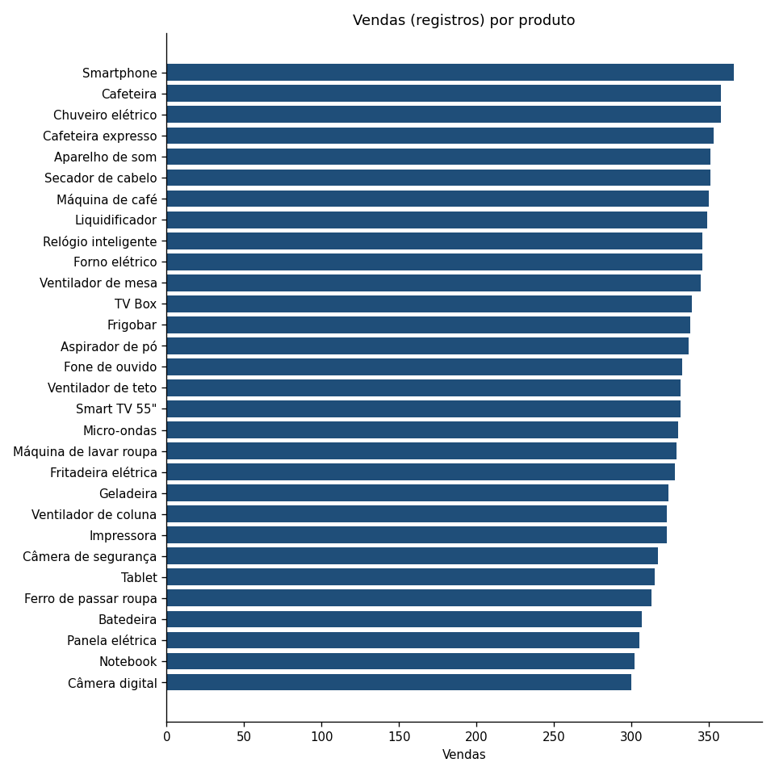
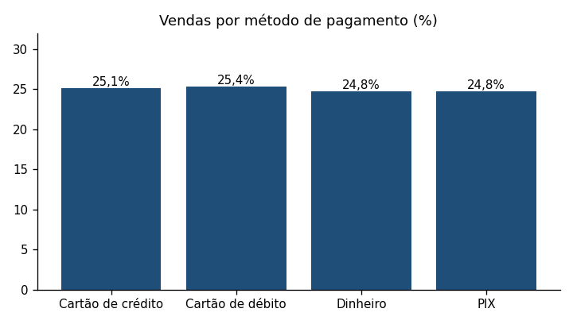
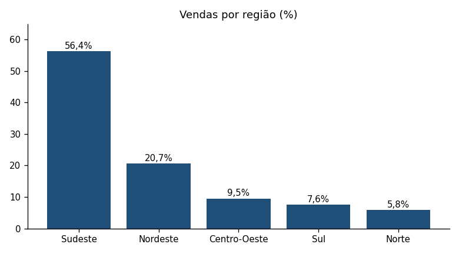
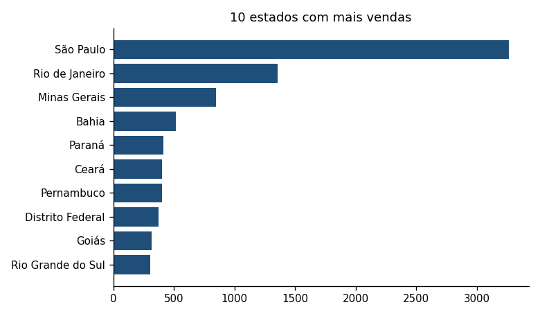
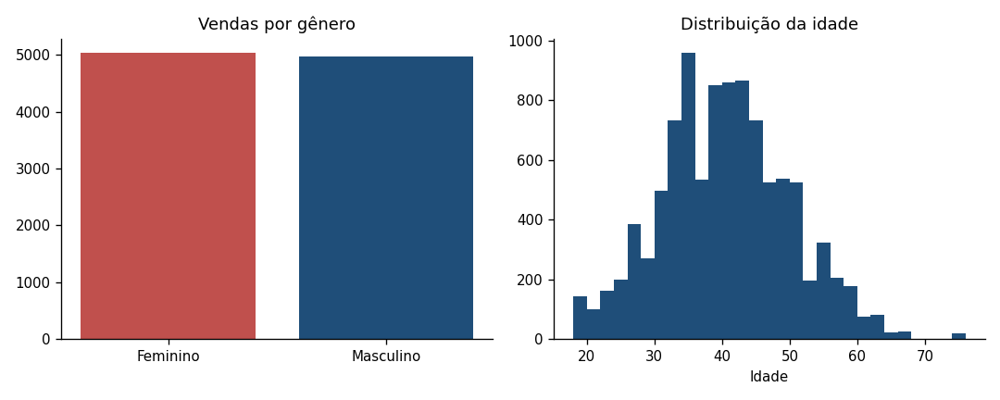
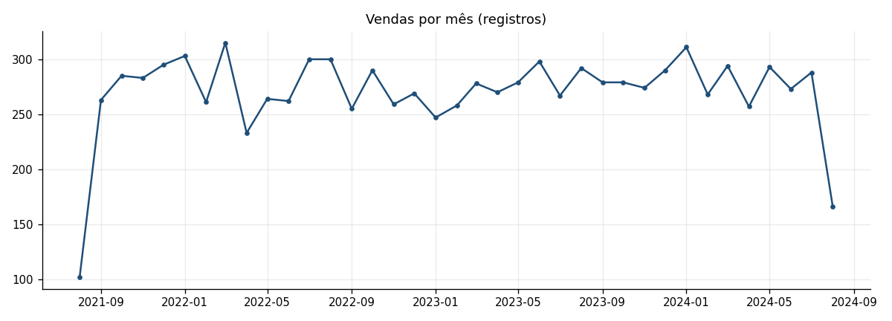
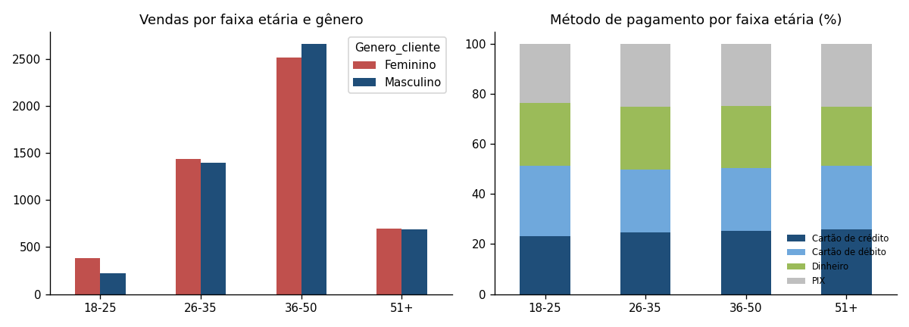
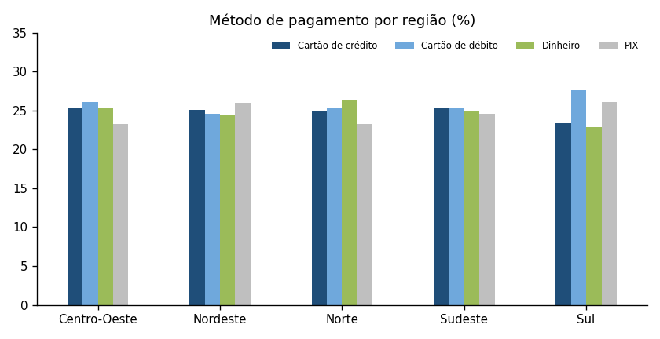
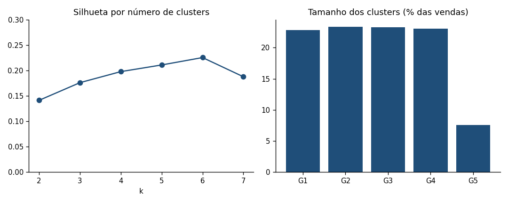

# Aula 5.1 · Identificação de padrões de compra

**Base:** `Vendas Zopp.xlsx`, com 10.000 vendas de 30 produtos, de 20/08/2021 a 19/08/2024. A aula tem dois prompts em sequência: o **Prompt 1** mapeia os padrões de compra, e o **Prompt 2** segmenta os clientes.

**Limites da base, que afetam esta aula e as seguintes:**
- **Não há identificador de cliente:** cada linha é uma venda, e não dá para saber quantas compras uma mesma pessoa fez. Por isso a "segmentação de clientes" é feita sobre o perfil de cada venda (idade, gênero, região).
- **Não há categoria de produto na base.** Usei a categoria dos feedbacks (os 30 nomes de produtos são idênticos, ver o [de-para](../04_sentimento_batedeiras/todos_produtos/de_para_produtos.md)).
- **O preço de cada produto é fixo** em toda a base, então a receita depende só do produto e da quantidade.
- **Um nome de estado estava com codificação quebrada** ("Rondônia", 22 vendas) e foi corrigido para Rondônia.

---

## Prompt 1 · Mapeamento de padrões de compra

### 1. Quantidade de registros

| Medida | Valor |
|---|---:|
| Vendas (registros) | **10.000** |
| Unidades vendidas | 20.078 (2,0 por venda) |
| Receita total | R$ 15.945.562 |
| Ticket médio por venda | R$ 1.594,56 |
| Período | 36 meses, sem valores nulos |

### 2. Vendas por produto

| Produto | Vendas | % das vendas | Média por mês | Unidades | Receita (R$) | % da receita | Preço (R$) |
|---|---:|---:|---:|---:|---:|---:|---:|
| Smartphone | 366 | 3,7% | 9,9 | 740 | 1.109.260 | 7,0% | 1.499 |
| Chuveiro elétrico | 358 | 3,6% | 9,7 | 721 | 64.169 | 0,4% | 89 |
| Cafeteira | 358 | 3,6% | 9,7 | 709 | 141.091 | 0,9% | 199 |
| Cafeteira expresso | 353 | 3,5% | 9,5 | 706 | 493.494 | 3,1% | 699 |
| Secador de cabelo | 351 | 3,5% | 9,5 | 719 | 107.131 | 0,7% | 149 |
| Aparelho de som | 351 | 3,5% | 9,5 | 705 | 351.795 | 2,2% | 499 |
| Máquina de café | 350 | 3,5% | 9,5 | 720 | 431.280 | 2,7% | 599 |
| Liquidificador | 349 | 3,5% | 9,4 | 713 | 106.237 | 0,7% | 149 |
| Forno elétrico | 346 | 3,5% | 9,4 | 708 | 282.492 | 1,8% | 399 |
| Relógio inteligente | 346 | 3,5% | 9,4 | 711 | 639.189 | 4,0% | 899 |
| Ventilador de mesa | 345 | 3,5% | 9,3 | 670 | 86.430 | 0,5% | 129 |
| TV Box | 339 | 3,4% | 9,2 | 665 | 198.835 | 1,2% | 299 |
| Frigobar | 338 | 3,4% | 9,1 | 691 | 621.209 | 3,9% | 899 |
| Aspirador de pó | 337 | 3,4% | 9,1 | 652 | 260.148 | 1,6% | 399 |
| Fone de ouvido | 333 | 3,3% | 9,0 | 657 | 130.743 | 0,8% | 199 |
| Smart TV 55" | 332 | 3,3% | 9,0 | 662 | 1.985.338 | 12,5% | 2.999 |
| Ventilador de teto | 332 | 3,3% | 9,0 | 662 | 164.838 | 1,0% | 249 |
| Micro-ondas | 330 | 3,3% | 8,9 | 675 | 336.825 | 2,1% | 499 |
| Máquina de lavar roupa | 329 | 3,3% | 8,9 | 652 | 1.564.148 | 9,8% | 2.399 |
| Fritadeira elétrica | 328 | 3,3% | 8,9 | 647 | 225.803 | 1,4% | 349 |
| Geladeira | 324 | 3,2% | 8,8 | 644 | 1.802.556 | 11,3% | 2.799 |
| Impressora | 323 | 3,2% | 8,7 | 626 | 374.974 | 2,4% | 599 |
| Ventilador de coluna | 323 | 3,2% | 8,7 | 634 | 126.166 | 0,8% | 199 |
| Câmera de segurança | 317 | 3,2% | 8,6 | 680 | 271.320 | 1,7% | 399 |
| Tablet | 315 | 3,1% | 8,5 | 620 | 743.380 | 4,7% | 1.199 |
| Ferro de passar roupa | 313 | 3,1% | 8,5 | 627 | 62.073 | 0,4% | 99 |
| Batedeira | 307 | 3,1% | 8,3 | 627 | 124.773 | 0,8% | 199 |
| Panela elétrica | 305 | 3,0% | 8,2 | 621 | 185.679 | 1,2% | 299 |
| Notebook | 302 | 3,0% | 8,2 | 626 | 2.190.374 | 13,7% | 3.499 |
| Câmera digital | 300 | 3,0% | 8,1 | 588 | 763.812 | 4,8% | 1.299 |

**Média:** 333,3 vendas por produto (mínimo 300, máximo 366), ou cerca de 9 vendas por mês. As vendas por produto são **praticamente iguais** (teste de uniformidade, p = 0,52): o Smartphone (366) não vende mais do que o Câmera digital (300) além do que o acaso explica.

**A receita, ao contrário, se concentra por causa do preço:** Notebook (13,7%), Smart TV 55" (12,5%), Geladeira (11,3%), Máquina de lavar roupa (9,8%) e Smartphone (7,0%) somam **54,3% da receita**. Por faixa de preço:

| Faixa de preço | % das vendas | % da receita |
|---|---:|---:|
| Até R$ 300 | 40,1% | 9,4% |
| R$ 301 a R$ 1.000 | 37,2% | 26,9% |
| Acima de R$ 1.000 | 22,7% | 63,7% |

### 3. Métodos de pagamento e canais

| Método | Vendas | % |
|---|---:|---:|
| Cartão de débito | 2.537 | 25,4% |
| Cartão de crédito | 2.510 | 25,1% |
| PIX | 2.477 | 24,8% |
| Dinheiro | 2.476 | 24,8% |

Os quatro métodos têm a mesma participação (p = 0,79). O mesmo vale para o canal: e-commerce 33,8% (Facebook 1.702 e Instagram 1.679 vendas), Loja 1 33,6% e Loja 2 32,6%. A receita acompanha as vendas em todos os casos.

### 4. Vendas por localidade

| Região | Vendas | % | Estados | Cidades | Média por cidade | Média por estado |
|---|---:|---:|---:|---:|---:|---:|
| Sudeste | 5.637 | 56,4% | 4 | 47 | 119,9 | 1.409,3 |
| Nordeste | 2.067 | 20,7% | 9 | 20 | 103,4 | 229,7 |
| Centro-Oeste | 952 | 9,5% | 4 | 6 | 158,7 | 238,0 |
| Sul | 760 | 7,6% | 3 | 11 | 69,1 | 253,3 |
| Norte | 584 | 5,8% | 6 | 8 | 73,0 | 97,3 |

**Estados (15 maiores de 26 com vendas):**

| Estado | Região | Vendas | % das vendas | Cidades | Média por cidade |
|---|---|---:|---:|---:|---:|
| São Paulo | Sudeste | 3.266 | 32,7% | 27 | 121,0 |
| Rio de Janeiro | Sudeste | 1.356 | 13,6% | 8 | 169,5 |
| Minas Gerais | Sudeste | 846 | 8,5% | 8 | 105,8 |
| Bahia | Nordeste | 519 | 5,2% | 4 | 129,8 |
| Paraná | Sul | 416 | 4,2% | 5 | 83,2 |
| Ceará | Nordeste | 403 | 4,0% | 3 | 134,3 |
| Pernambuco | Nordeste | 401 | 4,0% | 6 | 66,8 |
| Distrito Federal | Centro-Oeste | 375 | 3,8% | 1 | 375,0 |
| Goiás | Centro-Oeste | 319 | 3,2% | 3 | 106,3 |
| Rio Grande do Sul | Sul | 306 | 3,1% | 4 | 76,5 |
| Amazonas | Norte | 272 | 2,7% | 1 | 272,0 |
| Paraíba | Nordeste | 240 | 2,4% | 2 | 120,0 |
| Mato Grosso do Sul | Centro-Oeste | 189 | 1,9% | 1 | 189,0 |
| Espírito Santo | Sudeste | 169 | 1,7% | 4 | 42,2 |
| Piauí | Nordeste | 155 | 1,6% | 1 | 155,0 |

Roraima é o único estado sem nenhuma venda. São 92 cidades, com média de 108,7 vendas por cidade (mediana de 75,5). **As 10 maiores cidades concentram 44,2% das vendas:** São Paulo (1.524; 15,2%), Rio de Janeiro (773; 7,7%), Brasília (375; 3,8%), Salvador (316), Belo Horizonte (306), Manaus (272), Fortaleza (257), Goiânia (236), Campo Grande (189) e Porto Alegre (176).

### 5. Perfil demográfico

| Medida | Valor |
|---|---:|
| Mulheres | 5.031 (50,3%) |
| Homens | 4.969 (49,7%) |
| Idade média | 40,0 anos (mediana 40; desvio padrão 9,5; de 18 a 75) |
| Idade média, mulheres e homens | 39,8 e 40,3 |

| Faixa etária | Vendas | % | Ticket médio (R$) |
|---|---:|---:|---:|
| 18 a 25 | 605 | 6,0% | 1.678,50 |
| 26 a 35 | 2.841 | 28,4% | 1.579,80 |
| 36 a 50 | 5.174 | 51,7% | 1.594,90 |
| 51 ou mais | 1.380 | 13,8% | 1.587,00 |

A divisão por gênero é equilibrada (p = 0,54). **O público central tem de 36 a 50 anos** (51,7% das vendas).

### 6. Análise temporal

| Ano | Vendas | Unidades | Receita (R$) |
|---|---:|---:|---:|
| 2021 (a partir de 20/08) | 1.228 | 2.468 | 1.843.342 |
| 2022 | 3.311 | 6.702 | 5.392.578 |
| 2023 | 3.311 | 6.600 | 5.271.390 |
| 2024 (até 19/08) | 2.150 | 4.308 | 3.438.252 |

- **Média mensal:** 270,3 vendas (desvio de 38,5; o mínimo de 102 é agosto/2021, mês parcial; o máximo de 315 é março/2022).
- **Não há sazonalidade:** a média por mês do ano (2022 e 2023) fica entre 252 (abril) e 296 (março e agosto). Os dias da semana também são iguais (de 1.393 a 1.456 vendas).
- **Dias de maior movimento:** 10/03/2022 e 02/08/2023, com 19 vendas cada (média de 9,1 por dia).
- **Horário:** 80,5% das vendas ocorrem entre 8h e 17h59, com 750 a 880 vendas por hora; nas demais horas, de 126 a 160.
- **2022 e 2023 tiveram exatamente o mesmo número de vendas (3.311).**

### Leitura do Prompt 1

A Zoop vende volumes iguais de cada produto, por todos os canais e meios de pagamento, e **sem sazonalidade**. Os padrões que de fato existem são dois: a **receita se concentra em poucos produtos de ticket alto**, e as **vendas se concentram geograficamente** (Sudeste 56,4%; São Paulo, só a capital, 15,2%).

---

## Prompt 2 · Segmentação de clientes

Em cada cruzamento apliquei um **teste de associação** (qui-quadrado) e calculei o V de Cramér, que mede o tamanho da relação (de 0 a 1; abaixo de 0,1 é irrelevante). Isso separa diferença real de variação ao acaso.

### 1. Faixa etária e gênero

| Faixa etária | Mulheres | Homens | % mulheres | % do total (M / H) |
|---|---:|---:|---:|---|
| 18 a 25 | 381 | 224 | **63,0%** | 3,8% / 2,2% |
| 26 a 35 | 1.442 | 1.399 | 50,8% | 14,4% / 14,0% |
| 36 a 50 | 2.514 | 2.660 | 48,6% | 25,1% / 26,6% |
| 51 ou mais | 694 | 686 | 50,3% | 6,9% / 6,9% |

**É a única relação estatisticamente significativa da segmentação** (p < 0,001; V = 0,067): entre 18 e 25 anos as mulheres são 63,0% das vendas. O grupo, porém, é pequeno (6,0% das vendas) e a relação é fraca.

### 2. Região e método de pagamento

| Região | Vendas | Pagamento com maior participação | Participação |
|---|---:|---|---:|
| Sudeste | 5.637 | Cartão de crédito | 25,3% |
| Nordeste | 2.067 | PIX | 26,0% |
| Centro-Oeste | 952 | Cartão de débito | 26,1% |
| Sul | 760 | Cartão de débito | 27,6% |
| Norte | 584 | Dinheiro | 26,4% |

O "preferido" de cada região supera os 25% por no máximo 2,6 pontos percentuais. **A relação região × pagamento não é significativa** (p = 0,76; V = 0,017): é variação normal de amostra, não preferência regional.

### 3. Produtos e pagamentos por segmento (faixa etária e gênero)

Produtos mais comprados em cada segmento (as diferenças entre eles são de poucas vendas):

| Segmento | Vendas | Mais comprados (nº de vendas) | Pagamento com maior participação |
|---|---:|---|---|
| 18 a 25, mulheres | 381 | Notebook (19), Chuveiro elétrico (18), Forno elétrico (18) | Dinheiro (28,9%) |
| 18 a 25, homens | 224 | Máquina de café (13), Aspirador de pó (12), Impressora (12) | Cartão de débito (30,8%) |
| 26 a 35, mulheres | 1.442 | Chuveiro elétrico (64), Ventilador de mesa (63), Relógio inteligente (60) | Cartão de débito (26,4%) |
| 26 a 35, homens | 1.399 | Cafeteira (61), Smartphone (58), Ventilador de teto (53) | Dinheiro (26,4%) |
| 36 a 50, mulheres | 2.514 | Cafeteira expresso, Frigobar e Ventilador de coluna (95 cada) | Cartão de débito (25,5%) |
| 36 a 50, homens | 2.660 | Secador de cabelo e Liquidificador (99 cada), Ventilador de teto (97) | PIX (25,5%) |
| 51 ou mais, mulheres | 694 | Relógio inteligente (33), Smartphone (32), Batedeira (28) | Cartão de crédito (26,9%) |
| 51 ou mais, homens | 686 | TV Box (30), Cafeteira (29), Relógio inteligente (28) | Cartão de débito (26,7%) |

**Nenhuma dessas diferenças é real.** Os testes mostram que o perfil do cliente **não influencia** o que ele compra nem como paga:

| Relação testada | p | V de Cramér |
|---|---:|---:|
| Segmento × produto | 0,97 | 0,049 |
| Faixa etária × produto | 0,70 | 0,051 |
| Gênero × produto | 0,98 | 0,040 |
| Região × produto | 0,84 | 0,050 |
| Segmento × categoria (eletrodomésticos ou eletrônicos) | 0,36 | 0,028 |
| Segmento × faixa de preço | 0,80 | 0,022 |
| Segmento × método de pagamento | 0,29 | 0,028 |
| Idade × produto | 0,52 | – |

A proporção de eletrodomésticos fica entre 61% e 66% em todos os segmentos. O canal também não muda: o e-commerce representa de 32,2% a 34,6% das vendas em qualquer região, faixa etária ou gênero (p ≥ 0,33).

### 4. Agrupamento (clusters)

Apliquei K-means sobre idade, gênero, região, método de pagamento, canal, preço e categoria do produto e quantidade. A qualidade do agrupamento (silhueta) é **baixa**: entre 0,14 e 0,23 para 2 a 7 grupos (abaixo de 0,25 indica grupos pouco definidos). Com 5 grupos (silhueta de 0,21):

| Grupo | Vendas | O que o define | Idade | % mulheres | % online | Ticket (R$) |
|---|---:|---|---:|---:|---:|---:|
| 1 | 2.279 | Pagam com PIX (100%); 61% do Sudeste | 39,9 | 50,5% | 32,5% | 1.618,90 |
| 2 | 2.332 | Pagam com cartão de crédito (100%); 61% do Sudeste | 40,4 | 50,2% | 34,3% | 1.596,30 |
| 3 | 2.327 | Pagam com cartão de débito (100%); 61% do Sudeste | 39,9 | 51,1% | 33,9% | 1.584,00 |
| 4 | 2.302 | Pagam com dinheiro (100%); 61% do Sudeste | 39,8 | 51,7% | 34,3% | 1.555,90 |
| 5 | 760 | Região Sul (100%) | 40,6 | 43,6% | 34,5% | 1.665,40 |

**Os grupos só repetem o método de pagamento e a região Sul**: idade, gênero, canal e ticket são praticamente iguais entre eles. Não há segmentos de comportamento escondidos nesta base.

### Conclusões da Aula 5.1

1. **O perfil do cliente (idade, gênero, região) não explica o que ele compra, como paga ou por qual canal.** A única relação significativa é a de mulheres de 18 a 25 anos (63,0%), um grupo pequeno (6,0% das vendas).
2. **Os padrões que existem são de receita e de geografia:** poucos produtos de ticket alto concentram a receita (54,3% em 5 produtos) e o Sudeste concentra 56,4% das vendas. Essas são as alavancas que a Aula 5.2 explora.
3. **Personalizar por faixa etária, gênero ou método de pagamento não tem respaldo nos dados.** Para personalizar de verdade, a Zoop precisa de dados de cliente (histórico por pessoa) que a base não tem.
4. **Oportunidades iniciais:** público central de 36 a 50 anos (51,7% das vendas), um possível nicho de mulheres de 18 a 25 anos para testar, e as diferenças geográficas (a seguir).

> **Próximo passo (Aula 5.2):** aplicar a Matriz BCG aos produtos e a análise RFM às regiões.
