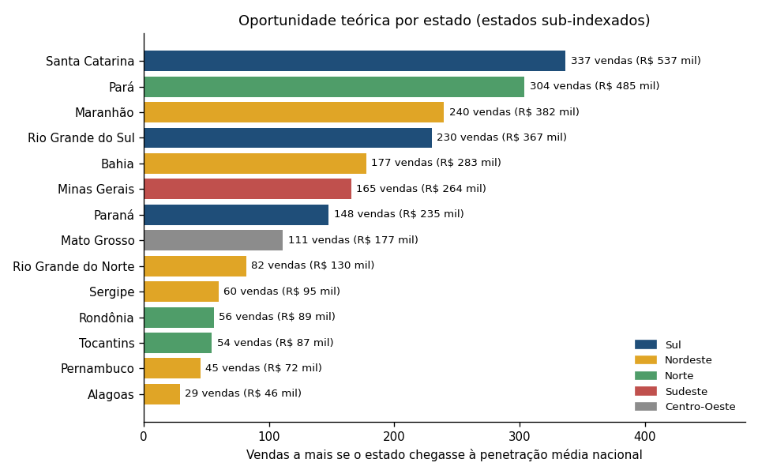
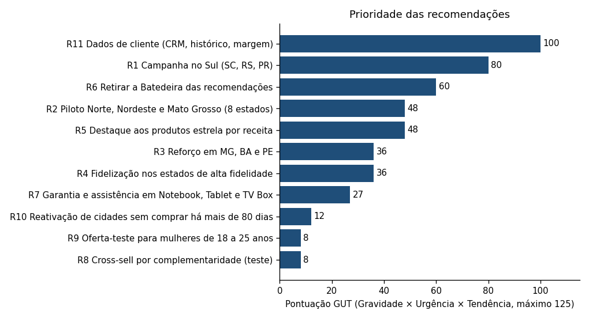

# Aula 5.3 · Recomendações personalizadas e priorização com a Matriz GUT

**Base:** as análises das Aulas [5.1](padroes_de_compra.md) e [5.2](oportunidades_bcg_rfm.md), as notas de avaliação dos produtos (feedbacks, escala de 1 a 5) e as vendas de `Vendas Zopp.xlsx`. Tabela completa em [dados/recomendacoes_gut.csv](dados/recomendacoes_gut.csv).

---

## Prompt 1 · Geração de recomendações personalizadas

### 1. Quais segmentos valem uma recomendação?

A Aula 5.1 mostrou que **idade, gênero e método de pagamento não mudam o que o cliente compra** (todos os testes com p ≥ 0,29). Por isso, recomendar produtos diferentes por faixa etária ou gênero **não tem respaldo nos dados**. Os segmentos que se sustentam são:

| Segmento | Por que é relevante | Evidência |
|---|---|---|
| **Região e estado** (por tipo de penetração) | Diferenças grandes e estatisticamente claras entre estados (índice de penetração de 0,10 a 2,70) | **Forte** |
| **Valor do produto** (estrelas por receita × demais) | 5 produtos concentram 34,2% da receita | **Forte** |
| **Qualidade percebida do produto** | A Batedeira tem nota significativamente menor (3,62; p ajustado = 0,001) | **Forte** |
| **Público central de 36 a 50 anos** | 51,7% das vendas | Moderada |
| **Mulheres de 18 a 25 anos** | 63,0% desse grupo são mulheres (p < 0,001), mas o grupo é de 6,0% das vendas e o ticket maior (R$ 1.809 contra R$ 1.586) não é significativo (p = 0,07) | Fraca |

### 2. Como a avaliação dos produtos foi usada

As notas dos 30 produtos variam de 3,62 a 4,02, e **só a Batedeira se distingue das demais**. A regra aplicada:
- **Não recomendar a Batedeira** até corrigir durabilidade e descrição do produto (21,2% de notas 1 e 2).
- **Recomendar com garantia** os produtos com mais notas baixas e grande receita: Notebook (18,9% de notas 1 e 2), Tablet (19,7%) e TV Box (18,0%). A diferença para os outros não é significativa, então não os tirei da lista.
- **Priorizar produtos com nota de 3,90 ou mais** quando a escolha é entre produtos equivalentes: Panela elétrica (4,02), Fritadeira elétrica (4,00), Liquidificador (4,00), Câmera digital (4,00).

### 3. Cesta de produtos por tipo de região

| Tipo de região | Estados | Cesta recomendada (nota média dos feedbacks) | Racional |
|---|---|---|---|
| **Alta fidelidade** | DF, RJ, SP, AM, MS, PB | Notebook (3,76), Smartphone (3,86), Tablet (3,82), Câmera digital (4,00), Relógio inteligente (3,86); âncora: Smart TV 55" (3,81), Geladeira (3,94), Máquina de lavar roupa (3,92) | Clientes que já compram acima do esperado: ofertas de ticket alto e cross-sell |
| **Potencial de crescimento** | MG, BA, PE, PR, RS | Estrelas por receita (Smartphone, Tablet, Câmera digital, Relógio) mais Notebook | Mercados grandes: o maior ganho de receita por venda adicional |
| **Subexplorada (piloto de entrada)** | SC, PA, MA, TO, RO, MT, SE, RN, AL (e Roraima) | Fritadeira elétrica (4,00; R$ 349), Liquidificador (4,00; R$ 149), Panela elétrica (4,02; R$ 299), Secador de cabelo (3,92; R$ 149), Fone de ouvido (3,93; R$ 199), TV Box (3,82; R$ 299) | **Hipótese:** produtos de ticket menor e boa nota reduzem a barreira de entrada; os dados não mostram preferência regional por produto (p = 0,84), então é preciso testar |
| **Todas** | – | Sem a Batedeira | Qualidade percebida |

### 4. Tabela de recomendações personalizadas

| ID | Segmento | Recomendação | Justificativa (dados) | Evidência |
|---|---|---|---|---|
| **R1** | **Sul** (SC, RS, PR) | Campanha regional de expansão com Smartphone, Tablet, Câmera digital e Relógio inteligente; começar por Santa Catarina e Rio Grande do Sul | Sul tem 14,7% da população e 7,6% das vendas (índice de 0,52); SC tem índice de 0,10 (38 vendas contra 375 esperadas), RS 0,57 e PR 0,74; a região cresceu 14,7% nos últimos 12 meses. Teto de 714 vendas (R$ 1,1 milhão) | Forte |
| **R2** | **Norte, Nordeste e Mato Grosso** sub-explorados (PA, MA, TO, RO, SE, RN, AL, MT; Roraima sem vendas) | Piloto regional com a cesta de entrada (ticket baixo e médio) e logística local | PA (0,24), MA (0,28), TO (0,27), RO (0,28), SE (0,45), RN (0,50); a região Norte caiu 3,1% e o Nordeste 4,5% no último ano. MT tem índice de 0,38. Teto de 411 vendas no Nordeste (sem BA e PE), 414 no Norte e 111 no Mato Grosso | Forte (índice); cesta é hipótese |
| **R3** | **MG, BA e PE** (grandes mercados abaixo do esperado) | Campanhas de volume com os produtos estrela por receita e com Notebook | MG (0,84), BA (0,75) e PE (0,90) têm muita população; lacuna de 165, 177 e 45 vendas (R$ 264 mil, R$ 283 mil e R$ 72 mil) | Moderada |
| **R4** | **Alta fidelidade** (DF, RJ, SP, AM, MS, PB) | Programa de fidelidade e cross-sell de ticket alto | Esses 6 estados, mais AC e AP (nichos fortes), têm 58,7% das vendas e 37,2% da população; DF (2,70), RJ (1,72) e SP (1,49) lideram | Forte (região); a ação depende de dados de cliente (R11) |
| **R5** | **Produtos estrela por receita** | Destacar Notebook, Smartphone, Câmera digital, Tablet e Relógio inteligente nas recomendações e no site | 34,2% da receita; Smartphone, Tablet e Câmera digital cresceram acima do total nos dois períodos | Moderada (o crescimento de produtos é instável: correlação de −0,46 entre períodos) |
| **R6** | **Todos os clientes** | Retirar a Batedeira das recomendações e sugerir Liquidificador, Fritadeira elétrica ou Panela elétrica | Nota de 3,62 contra 3,88; as alternativas têm nota 4,00 a 4,02 e menos notas baixas (8,5% a 13,8%) | Forte |
| **R7** | **Compradores de Notebook, Tablet e TV Box** | Oferecer garantia estendida e assistência junto com a venda | Maior percentual de notas 1 e 2 (18,9%, 19,7% e 18,0%), embora sem significância | Fraca |
| **R8** | **Compradores de eletrônicos** | Testar cross-sell por complementaridade: Smartphone com Fone de ouvido e Relógio inteligente; Notebook com Impressora; Smart TV com TV Box e Aparelho de som | **Hipótese:** a base não tem dados de cesta de compras, então não há evidência de que esses pares sejam comprados juntos | Fraca |
| **R9** | **Mulheres de 18 a 25 anos** | Oferta-teste dirigida (comunicação e mix) com medição de resultado | 63,0% do grupo são mulheres (p < 0,001); ticket R$ 1.809 contra R$ 1.586 (p = 0,07); grupo de 3,8% das vendas | Fraca |
| **R10** | **Cidades sem comprar há mais de 80 dias** (Cotia, Caxias do Sul, Guarujá, Cuiabá) | Ação local de reativação | Recência de 86 a 134 dias; poucas vendas no histórico (20 a 69) | Fraca |
| **R11** | **Base de clientes** | Passar a registrar o cliente (identificador, histórico, parcelamento) e a margem por produto | A RFM e a segmentação só puderam ser feitas por localidade; sem isso a personalização individual não é possível | Habilitadora |
| **R12** | **Meio de pagamento, canal e gênero** | **Não personalizar** por esses fatores: manter os quatro meios de pagamento e os três canais | Participações iguais (p entre 0,29 e 0,89) | Forte (para não agir) |

### 5. Sugestão visual: onde está a oportunidade

O gráfico mostra a diferença de vendas se cada estado sub-indexado chegasse à penetração nacional. Santa Catarina (337), Pará (304), Maranhão (240) e Rio Grande do Sul (230) lideram. É um teto teórico: ignora renda e presença de lojas.

---

## Prompt 2 · Priorização com a Matriz GUT

### 1. Pontuação (1 a 5 em cada critério)

Gravidade = impacto nas vendas ou na experiência; Urgência = necessidade de agir já; Tendência = chance de a oportunidade crescer (ou se perder) se nada for feito.

| ID | Recomendação | G | U | T | **GUT** | Justificativa das notas |
|---|---|---:|---:|---:|---:|---|
| R11 | Dados de cliente (CRM, histórico, margem) | 5 | 5 | 4 | **100** | Sem isso R4, R8 e R9 não existem e a RFM por cliente é impossível |
| R1 | Campanha no Sul | 5 | 4 | 4 | **80** | Maior lacuna regional comprovada (714 vendas, índice de 0,52); a região já cresce (+14,7%) |
| R6 | Retirar a Batedeira das recomendações | 3 | 5 | 4 | **60** | Custo zero, efeito imediato e nota em queda recente |
| R2 | Piloto Norte, Nordeste e Mato Grosso | 4 | 3 | 4 | **48** | Lacuna de 936 vendas somadas; Norte e Nordeste caíram no último ano |
| R5 | Destaque aos produtos estrela por receita | 4 | 4 | 3 | **48** | 34,2% da receita; ação simples de vitrine |
| R3 | Reforço em MG, BA e PE | 4 | 3 | 3 | **36** | Mercados grandes com lacuna moderada |
| R4 | Fidelização nos estados de alta fidelidade | 4 | 3 | 3 | **36** | Base fiel (58,7% das vendas), mas depende de R11 |
| R7 | Garantia em Notebook, Tablet e TV Box | 3 | 3 | 3 | **27** | Efeito sobre a satisfação, sem significância estatística |
| R10 | Reativação de cidades | 2 | 3 | 2 | **12** | Casos pontuais, poucas vendas |
| R8 | Cross-sell (teste) | 2 | 2 | 2 | **8** | Sem evidência de complementaridade |
| R9 | Oferta para mulheres de 18 a 25 anos (teste) | 2 | 2 | 2 | **8** | Grupo pequeno e efeito de ticket não significativo |

(R12, "não personalizar por pagamento, canal ou gênero", é uma decisão de não agir e não entra na pontuação.)

### 2. Lista final de recomendações priorizadas

**Prioridade máxima (GUT de 60 a 100):**
1. **R11:** estruturar os dados de cliente e de margem.
2. **R1:** campanha de expansão no Sul, começando por Santa Catarina e Rio Grande do Sul.
3. **R6:** retirar a Batedeira das recomendações.

**Prioridade alta (GUT de 36 a 48):**
4. **R2:** piloto no Pará e no Maranhão (e depois TO, RO, SE, RN e AL).
5. **R5:** destaque aos produtos estrela por receita.
6. **R3** e **R4:** reforço em MG, BA e PE, e programa de fidelização (este depende de R11).

**Segundo plano ou monitoramento (GUT abaixo de 36):**
7. **R7:** garantia em Notebook, Tablet e TV Box.
8. **R10, R8 e R9:** reativação local e dois testes pequenos.

### 3. Cronograma básico

| Período | Ações |
|---|---|
| **Semanas 1 e 2** | R6 (retirar a Batedeira); R5 (definir os produtos de destaque); R11 (definir quais dados de cliente e margem coletar) |
| **Semanas 3 a 8** | R1: piloto em Santa Catarina e Rio Grande do Sul, com acompanhamento do índice de penetração; R10 (reativação) |
| **Meses 3 e 4** | R2 (Pará e Maranhão); R3 (MG, BA e PE); R7 |
| **Meses 4 a 6** | R4 (fidelização, com os dados de cliente já disponíveis); testes R8 e R9 |
| **Contínuo** | Recalcular a Matriz BCG e o índice de penetração por estado a cada trimestre |

### 4. Como medir o resultado

- **Índice de penetração por estado** (vendas ÷ população): cada 10% da lacuna total fechada equivale a cerca de **204 vendas, ou R$ 325 mil**.
- **Vendas e receita por estado e por produto**, comparadas com o mesmo período do ano anterior.
- **Nota média dos feedbacks** dos produtos recomendados.

## Limites

- Não há identificador de cliente nem histórico por pessoa: as recomendações são por localidade e por produto, não individuais.
- A lacuna regional (R$ 3,25 milhões) é um teto teórico: assume o mesmo consumo por habitante em todos os estados, sem considerar renda ou presença de lojas.
- Os testes de perfil (idade, gênero, pagamento) não encontraram diferenças, então qualquer personalização por esses fatores seria hipótese.
- As notas GUT são julgamento técnico e devem ser revisadas com as áreas envolvidas.
- A cesta de entrada para estados sub-explorados e os pares de cross-sell são hipóteses a validar em teste.
