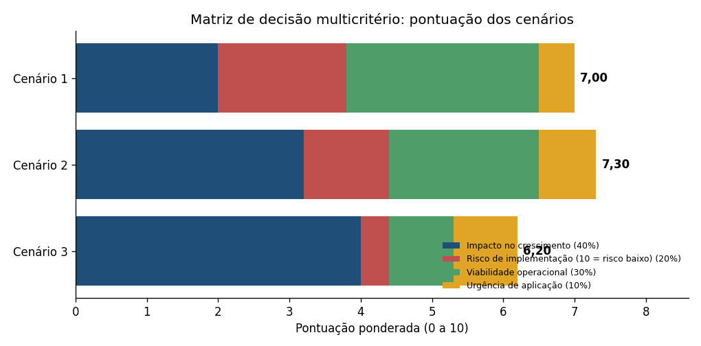
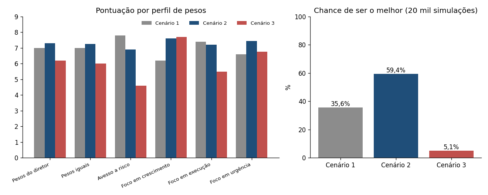

# Aula 6.3 · Decisão sem dados com cenários e heurísticas

**Objetivo:** escolher entre os três cenários da [Aula 6.1](cenarios_e_decisao_intuitiva.md) usando uma **matriz de decisão multicritério** e validar a escolha com **heurísticas** e a experiência do diretor. Marcações: **[N]** Notion, **[D]** dados do projeto, **[S]** suposição.

---

## Prompt 1 · Matriz de decisão multicritério

### 1. Os cenários (sem mudança)

| Cenário | Resumo |
|---|---|
| **1 · Brasil primeiro** | Reorganização das lojas em fases e estudo de mercado; nenhuma operação internacional por 12 meses |
| **2 · Piloto internacional + layout em fases** | Piloto de e-commerce em um país da América Latina com parceiro local, mais a mesma reorganização das lojas; ponto de decisão após o piloto |
| **3 · Expansão simultânea** | Vários países com e-commerce e lojas físicas, aquisição de startups e reorganização das 200+ lojas de uma vez |

### 2. Resultado do brainstorming (resumo)

A equipe priorizou **entrada por e-commerce, parceria com startups locais e lojas reorganizadas para automação residencial** (impacto alto, viabilidade moderada), com **testes-piloto antes de expansão física**, uma plataforma de análise preditiva e introdução gradual da automação com suporte técnico local. O caminho aponta para o Cenário 2.

### 3. Critérios e pesos definidos pelo diretor [N]

| Critério | Peso | Por que importa | Como ler a nota (1 a 10) |
|---|---:|---|---|
| **Impacto no crescimento da empresa** | 40% | A expansão e o aumento de receita são a prioridade para sustentar o sucesso de longo prazo | 10 = maior crescimento potencial |
| **Viabilidade operacional** | 30% | O cenário precisa caber nos recursos de capital e de pessoal | 10 = plenamente executável hoje |
| **Risco de implementação** | 20% | Há capacidade de mitigar riscos, e o medo não deve limitar as decisões | **10 = risco mais baixo** (nota alta é boa) |
| **Urgência de aplicação** | 10% | Agir rápido ajuda, mas não é o fator mais crítico | 10 = responde melhor à pressão de tempo |

### 4. Matriz sugerida (notas de 1 a 10)

| Cenário | Impacto (40%) | Risco (20%) | Viabilidade (30%) | Urgência (10%) | **Pontuação** |
|---|---:|---:|---:|---:|---:|
| **1 · Brasil primeiro** | 5 | 9 | 9 | 5 | **7,0** |
| **2 · Piloto internacional + layout** | 8 | 6 | 7 | 8 | **7,3** |
| **3 · Expansão simultânea** | 10 | 2 | 3 | 9 | **6,2** |

**Cálculo (nota × peso, somadas):**
- Cenário 1: 5 × 0,40 + 9 × 0,20 + 9 × 0,30 + 5 × 0,10 = 2,0 + 1,8 + 2,7 + 0,5 = **7,0**
- Cenário 2: 8 × 0,40 + 6 × 0,20 + 7 × 0,30 + 8 × 0,10 = 3,2 + 1,2 + 2,1 + 0,8 = **7,3**
- Cenário 3: 10 × 0,40 + 2 × 0,20 + 3 × 0,30 + 9 × 0,10 = 4,0 + 0,4 + 0,9 + 0,9 = **6,2**

### 5. Justificativa das notas

**As notas são minha proposta, baseada em julgamento, e podem ser reescritas ou aprovadas pelo diretor.**

| Cenário | Impacto | Risco | Viabilidade | Urgência |
|---|---|---|---|---|
| **1** | **5:** só cresce no Brasil; os dados mostram espaço doméstico (regiões sub-exploradas e produtos de maior valor [D]), mas o efeito do novo layout sobre as vendas não foi medido | **9:** opera onde a Zoop já tem equipe, marca e logística | **9:** é executável com os recursos atuais | **5:** trata a queda de tráfego das lojas, mas não a pressão por expansão e a concorrência |
| **2** | **8:** abre o mercado internacional e mantém o ganho do layout; o piloto sozinho tem efeito pequeno no curto prazo | **6:** risco limitado e reversível, mas exige parceiro e logística novos | **7:** duas frentes exigem coordenação, mas o caixa existe | **8:** responde à pressão de concorrentes e acionistas já no primeiro ano |
| **3** | **10:** maior alcance e velocidade | **2:** compromete caixa, opera em vários países e não tem ponto de saída | **3:** falta logística internacional e mão de obra para fazer tudo ao mesmo tempo | **9:** máxima resposta à pressão de tempo |

> **João, você pode reescrever esta matriz ou aprová-la.** Se as notas ou os pesos mudarem, a pontuação e a escolha mudam, como mostra a próxima seção.

### 6. Teste de sensibilidade

Como as notas são julgamento, testei o resultado com outros pesos:

| Perfil de pesos (impacto, risco, viabilidade, urgência) | Cenário 1 | Cenário 2 | Cenário 3 | Vencedor |
|---|---:|---:|---:|---|
| **Pesos do diretor** (40, 20, 30, 10) | 7,0 | **7,3** | 6,2 | Cenário 2 |
| Pesos iguais (25, 25, 25, 25) | 7,0 | **7,3** | 6,0 | Cenário 2 |
| Avesso a risco (20, 40, 30, 10) | **7,8** | 6,9 | 4,6 | Cenário 1 |
| Foco em crescimento (60, 10, 20, 10) | 6,2 | 7,6 | **7,7** | Cenário 3 |
| Foco em execução (30, 20, 40, 10) | **7,4** | 7,2 | 5,5 | Cenário 1 |
| Foco em urgência (30, 15, 25, 30) | 6,6 | **7,5** | 6,8 | Cenário 2 |

**O que isso mostra:**
- **A vantagem do Cenário 2 é pequena:** 0,3 ponto sobre o Cenário 1, dentro da margem de erro de notas de julgamento.
- **O Cenário 2 vence enquanto o peso do impacto fica entre cerca de 33% e 61%** (o restante dividido na mesma proporção). Abaixo disso, vence o Cenário 1; acima, o Cenário 3.
- **O Cenário 2 perde para o 1** se a nota de impacto do Cenário 2 cair abaixo de 7,25 (hoje 8) ou se a do Cenário 1 passar de 5,75 (hoje 5).
- **Simulação:** variando pesos e notas ao mesmo tempo (20 mil sorteios, notas ±1,5 e pesos em torno dos do diretor), o Cenário 2 é o melhor em **59,4%** dos casos, o Cenário 1 em **35,6%** e o Cenário 3 em **5,1%**.
- **O Cenário 3 só vence com um foco extremo em crescimento**, e por 0,1 ponto.

**Conclusão da matriz:** o Cenário 2 é a melhor escolha com os pesos do diretor, mas **não é uma vitória folgada**. Quem pesa mais o risco ou a execução prefere o Cenário 1.

---

## Prompt 2 · Decisão final e validação heurística

### 1. Revisão da decisão inicial

O cenário com a melhor pontuação é o **Cenário 2** (7,3). *Pergunta ao diretor:* "Com base na pontuação, você está confortável com essa escolha? Há algo que gostaria de reconsiderar antes de seguir?"

**Ponto a reconsiderar:** como o Cenário 2 **contém** o Cenário 1, a decisão real se divide em duas:
1. **Reorganizar as lojas em fases** (comum aos dois cenários). Essa parte está nos Cenários 1 e 2, que venceram em cinco dos seis perfis de pesos, então dificilmente gera arrependimento.
2. **Adicionar um piloto internacional limitado.** É aqui que está a dúvida: o piloto compensa o risco e o custo extra?

### 2. Experiência passada do diretor [N]

| Experiência | O que ensina para esta decisão |
|---|---|
| **Expansão logística na Electra Brasil (2005 a 2010):** ajuste da distribuição por região | Sustenta a capacidade de montar logística, mas no exterior entram tarifas, alfândega e normas que não existiam no Brasil |
| **Migração da Zoop para o e-commerce:** agilidade e adaptação reduziram o risco | Apoia a entrada gradual e flexível com piloto |
| **TechWorld (2000 a 2005):** marketing digital e +30% nas vendas de eletrônicos | Apoia campanhas digitais localizadas e a entrada por e-commerce |
| **Inovação e antecipação de tendências** como base do sucesso da Zoop | Pode empurrar para a escala (Cenário 3), em tensão com a cautela do piloto |

### 3. Pressões internas e externas

| Pressão | Efeito sobre a decisão | Como tratar |
|---|---|---|
| Acionistas e equipe pedem crescimento internacional [N] | Empurra para decidir depressa (Cenário 3) | Cronograma com datas e metas do piloto, para mostrar avanço sem assumir risco total |
| Concorrentes (TechPro e Electro World) já na região [N] | Reduz a janela de entrada | O piloto é a forma mais rápida de entrar sem risco total |
| Queda de tráfego nas lojas [N] | Torna o layout urgente | A reorganização em fases começa já |
| Escassez de mão de obra [N] | Limita fazer muita coisa ao mesmo tempo | Equipes separadas e cronograma escalonado |
| Regulação e tarifas [N] | Pode tornar um país inviável | Entrar no critério de escolha do país |
| Falta de dados de mercado | Aumenta a incerteza | Estudos curtos e baratos antes do piloto |

### 4. Validação por heurísticas

| Heurística | Aplicação | Resultado |
|---|---|---|
| **Decisões reversíveis primeiro** | Piloto de e-commerce e layout em fases podem ser interrompidos; lojas físicas no exterior e várias aquisições não | Favorece o Cenário 2 |
| **Minimizar o arrependimento** | Cenário 1: arrepender-se de perder a janela. Cenário 3: arrepender-se de uma perda grande e sem saída. Cenário 2: arrependimento moderado nos dois casos | Cenário 2 tem o menor arrependimento máximo |
| **Opção real** | Pagar um custo pequeno (o piloto) para ganhar a informação que falta antes de comprometer mais | Favorece o Cenário 2 |
| **Compromisso prévio** | Definir antes teto de perda e critérios de parada, para evitar insistir por pressão | Incorporado à decisão (seção 5) |
| **Testar onde é barato** | Testar o novo layout no Brasil antes de levá-lo ao exterior | Ajusta a ideia de testar lojas no exterior |
| **Bom o bastante** | Escolher o cenário que atende os critérios essenciais sem buscar o máximo teórico | Cenário 2 |

### 5. Decisão final proposta: Cenário 2, com limites e pontos de parada

**Decisão:** seguir o **Cenário 2**: reorganizar as lojas brasileiras em fases e lançar um **piloto de e-commerce em um país da América Latina**, com parceiro local, suporte técnico local e um **ponto de decisão** ao fim do piloto. A decisão está **pendente da confirmação do diretor**.

**Ajustes às ideias iniciais (pela validação):**
- Testar os novos conceitos de loja **no Brasil** antes de qualquer loja no exterior.
- Começar com **parceria com opção de compra**, não com aquisição imediata de startups [S].
- Validar a **demanda por automação residencial** (pesquisa curta ou teste de vendas) antes de torná-la eixo [D].
- Escolher o país por **critérios definidos antes** (tamanho do e-commerce, regulação, logística, concorrência).

**Metas do piloto (hipóteses [S], a definir com Finanças e Operações):**

| Indicador | Meta inicial | Quando medir |
|---|---|---|
| Conversão do e-commerce no país-piloto | Pelo menos 70% da conversão do Brasil | Mês 6 |
| Pedidos entregues no prazo prometido | 90% ou mais | Mês 6 |
| Taxa de devolução | No máximo 1,5 vez a do Brasil | Mês 9 |
| Contribuição por pedido (receita menos custos variáveis) | Maior ou igual a zero | Mês 9 |
| Satisfação dos clientes | Não pior que 10% abaixo da do Brasil | Mês 9 |
| Layout nas lojas-piloto | Aumento do ticket médio e das vendas de produtos de maior valor frente a lojas de controle (limiar a definir; ponto de partida de 5%) | Duas ondas de medição |

**Critérios de parada:**
- O investimento acumulado do piloto atingir o **teto aprovado antes** (valor a definir com a Finanças).
- No mês 9, **duas ou mais metas** do piloto não forem atingidas.
- Um problema regulatório ou do parceiro tornar a operação inviável.

### 6. Pré-mortem: "estamos em 24 meses e o piloto fracassou. Por quê?"

| Causa provável | Sinal de alerta | Prevenção |
|---|---|---|
| País escolhido sem critério | Conversão e ticket muito abaixo desde o início | Critérios e comparação de 2 ou 3 países antes |
| Parceiro local com metas desalinhadas | Atrasos, acesso limitado aos dados dos clientes | Contrato com metas e cláusulas de saída |
| Logística e regulação subestimadas | Atrasos e custo por pedido acima do previsto | Estudo de regulação e de tarifas antes do lançamento |
| Equipe sobrecarregada por duas frentes | Atrasos nas duas | Equipes separadas e responsável por frente |
| Automação sem demanda | Poucas vendas nessa linha | Validar a demanda antes e começar por produtos conhecidos |
| Efeito vitrine nas lojas | Mais visitas, sem aumento de vendas | Medir vendas por loja e integrar a venda online à loja |

### 7. Confirmação final

> **Agora que revisamos a matriz, suas experiências anteriores e as pressões do cenário, você está pronto para confirmar a decisão final? Há algum detalhe a ajustar antes de seguir com o plano?**

### 8. Cronograma da decisão

| Período | O que acontece |
|---|---|
| **Meses 0 a 3** | Critérios e escolha do país-piloto; seleção do parceiro; estudo de regulação; escolha das lojas da fase 1; definição de metas, teto de perda e responsáveis |
| **Meses 3 a 9** | Lançamento do piloto; reorganização das lojas da fase 1 e medição contra lojas de controle |
| **Meses 9 a 12** | **Ponto de decisão:** ampliar, ajustar ou parar, com base nas metas |

---

## Integração com o módulo 1 (matriz de decisão enriquecida)

O módulo 1 definiu três tipos de decisão e o papel da IA em cada um. Esta decisão da Zoop passou pelos três:

| Tipo de decisão | Onde apareceu no módulo 6 | Papel da IA | Resultado |
|---|---|---|---|
| **Racional** | Matriz multicritério e dados do projeto (Aula 6.3) | Calcular, testar a sensibilidade e simular a incerteza das notas | Cenário 2, com vantagem pequena (7,3) |
| **Intuitiva** | Respostas do diretor e validação heurística (Aulas 6.1 e 6.3) | Mentor: perguntas, simulação de cenários, crítica construtiva e pré-mortem, sem recorrer a análise de dados | Entrada gradual; testar o layout no Brasil antes de exportar |
| **Colaborativa** | SWOT e brainstorming (Aula 6.2) | Facilitar: perguntas e organização das ideias da equipe, sem dar respostas prontas | Consenso em torno de piloto de e-commerce, parceria local e layout com automação |

As três perspectivas **convergem no Cenário 2**, o que fortalece a decisão, mas ele ainda depende de suposições (notas, metas e a demanda por automação) que o piloto deve validar.

## Limites e suposições

- **As notas da matriz são julgamento**, e a vantagem do Cenário 2 é pequena. Quem pesa mais o risco ou a execução prefere o Cenário 1.
- **Não há dados internacionais.** Metas, prazos e o teto de perda são hipóteses, sem valores em dinheiro.
- **Escala:** os dados do projeto (cerca de R$ 16 milhões em três anos) não têm a dimensão da empresa descrita (US$ 5 bilhões); foram usados só em proporções.
- **Demanda de automação residencial:** não há evidência nos dados de vendas.
- **Inconsistência de nomes:** o diretor aparece como João Costa e como Carlos Souza em módulos diferentes.
- A **decisão final depende da confirmação do diretor**; nada foi decidido em nome dele.
